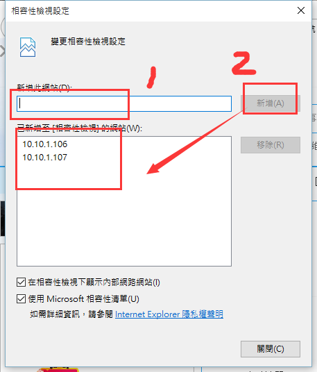
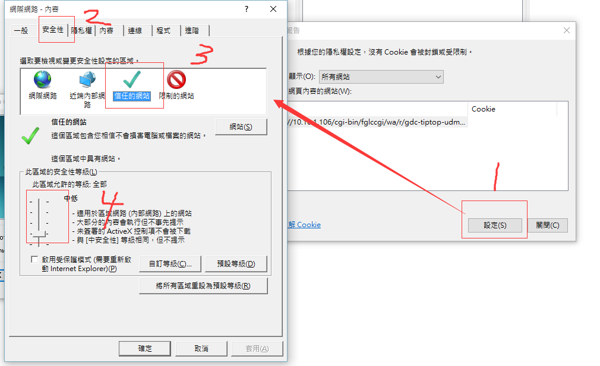
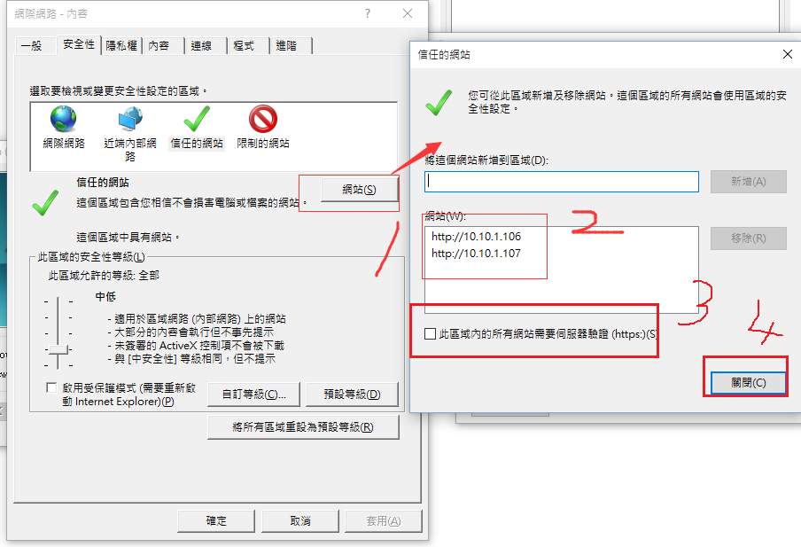
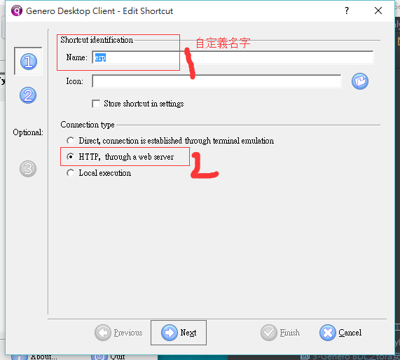
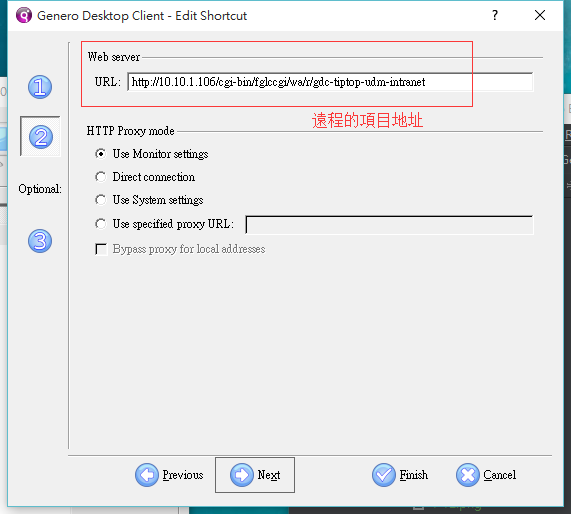
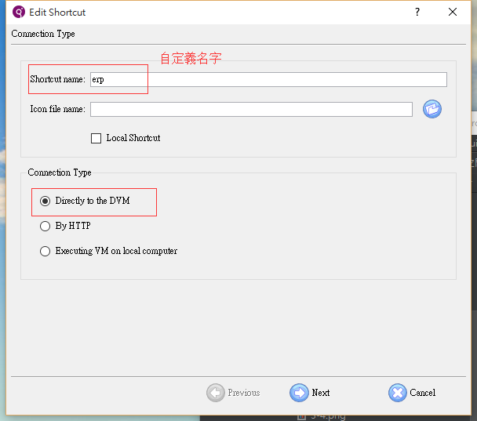
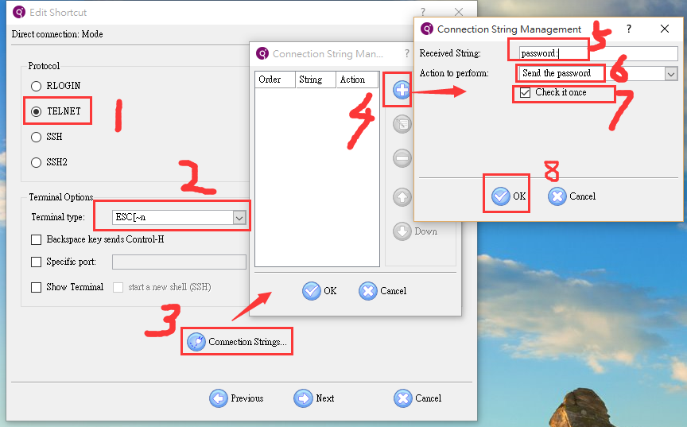
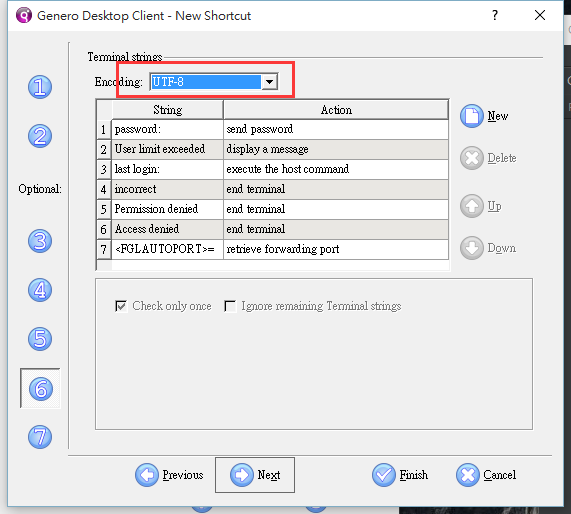
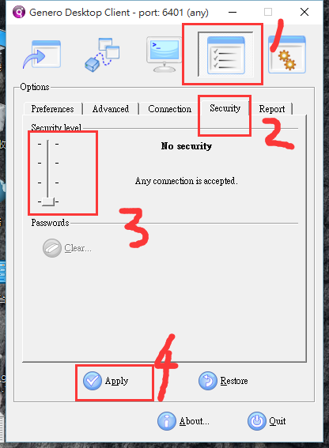
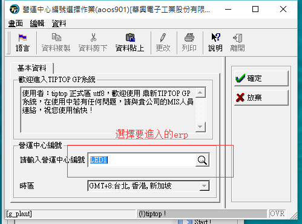

總操縱流程：
- 1、[下載安裝](#gbl-01)
- 2、[登錄erp](#gbl-02)
    - 2.[1、使用web登錄](#gbl-02-01)
    - 2.[2、使用gdc登錄](#gbl-02-02)
- 3、[測試](#gbl-03)

***

#  <a name="gbl-01" href="#" >下載安裝</a>

[](https://pan.baidu.com/s/13JRNOMIZwA44vgt_jdUnsg)

`我是选：fjs-gdc-2.40.16-build4635.58-w32vc90进行安装的`

# <a name="gbl-02" href="#" >使用登錄erp</a>

###  <a name="gbl-02-01" href="#" >1、使用web登錄</a>

- 設置ie


- 將安全降低








- 登錄密碼


```
局域網的地址：10.10.1.106

賬號：tiptop
密碼：tt2218led
```


###  <a name="gbl-02-02" href="#" >2、使用gdc登錄</a>

- 修改GDC登录快捷方式


- 创建erp登陆程序


#### 設置方法一



```
http://10.10.1.106/cgi-bin/fglccgi/wa/r/gdc-tiptop-udm-intranet
```



#### 設置方法二(新版才有的功能)








- GDC的安全级别至最低



# <a name="gbl-03" href="#" >測試</a>



