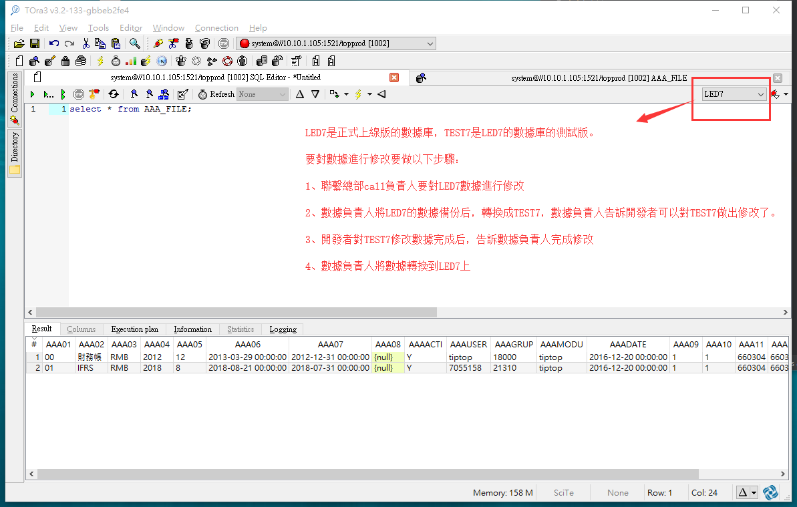
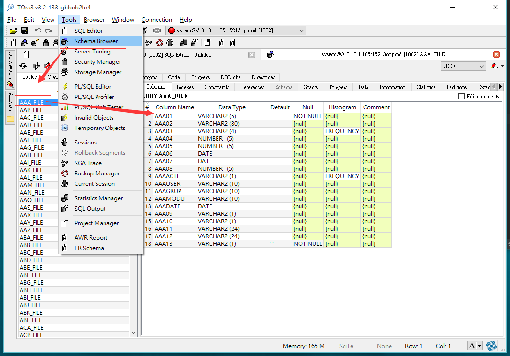

總操作流程：
- 1、[使用tora的方式](#gbl-01)
    - 1.[1、使用tora登錄oracle](#gbl-01-01)
    - 1.[2、使用界面查看修改表結構](#gbl-01-02)
    - 1.[3、使用sql命令查看修改表結構](#gbl-01-03)

- 2、[登錄tiptop的erp界面的方式](#gbl-02)
    - 2.[1、使用gdc登錄erp](#gbl-02-01)
    - 2.[2、輸入命令登錄進界面查看標結構](#gbl-02-02)

***

`注意:`


# <a name="gbl-01" href="#" >使用tora的方式</a>

### <a name="gbl-01-01" href="#" >1、使用tora登錄oracle</a>


###  <a name="gbl-01-02" href="#" >2、使用界面查看修改表結構</a>



###  <a name="gbl-01-03" href="#" >3、使用sql命令查看修改表結構</a>


# <a name="gbl-02" href="#" >登錄tiptop的erp界面的方式</a>

`注意：這種方式修改是對數據庫起不到任何作用的，這裡修改是提供查看文檔的作用`

### <a name="gbl-02-01" href="#" >1、使用web方式登錄erp</a>

```
賬號：tiptop
密碼：tt2218led
```


### <a name="gbl-02-02" href="#" >2、輸入命令登錄進界面查看標結構</a>


