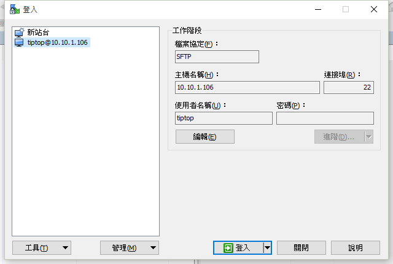
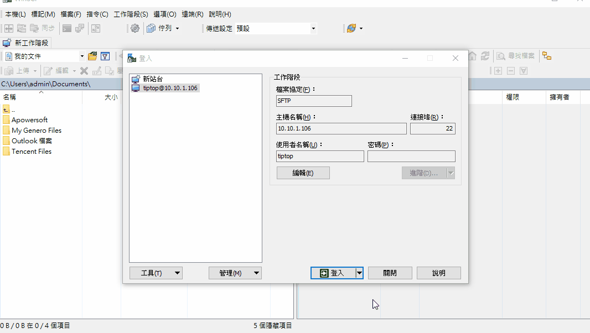

總操作流：
- 1、[下載安裝](#gbl-01)
- 2、[配置](#gbl-02)
- 3、[測試](#gbl-03)

***

#  <a name="gbl-01" href="#" >下載安裝</a>

-  pietty

[](https://pan.baidu.com/s/1Zh2SmCSamdwBqemShYmIWg)

`因為公司路由的問題pietty經常會掉線，需要將ip添加到路由：route add 10.10.1.0 mask 255.255.255.0 10.10.2.7 -P`

`刪除的命令：route delete 10.10.1.0 mask 255.255.255.0`

- WinSCP

[](https://sourceforge.net/projects/winscp/)


# <a name="gbl-02" href="#" >配置</a>

-  pietty


-  WinSCP



# <a name="gbl-03" href="#" >測試</a>

-  pietty

```
密碼：tiptop
```


- WinSCP

