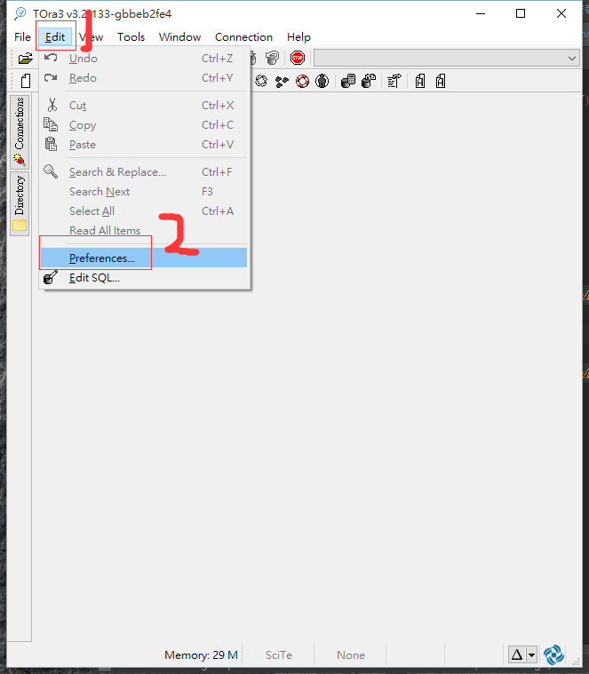
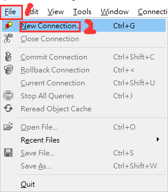

總操作了流程：
- 1、[下載安裝](#gbl-01)
- 2、[配置](#gbl-02)
- 3、[測試](#gbl-03)

***

#  <a name="gbl-01" href="#" >下載安裝</a>

- 下載tora

[](https://sourceforge.net/projects/tora/)

- 下載oracle的客戶端

[](https://pan.baidu.com/s/1IDxhrRj_3MS9qRW8FkhkGQ)

# <a name="gbl-02" href="#" >配置</a>




# <a name="gbl-03" href="#" >測試</a>



```
Username：system

Password：manager

Host: 10.10.1.105

Port: 1521

Database: topprod

Color Session Identifier:Production
```


