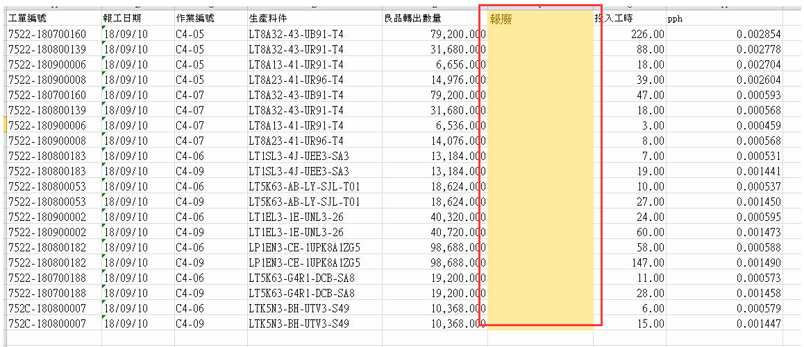
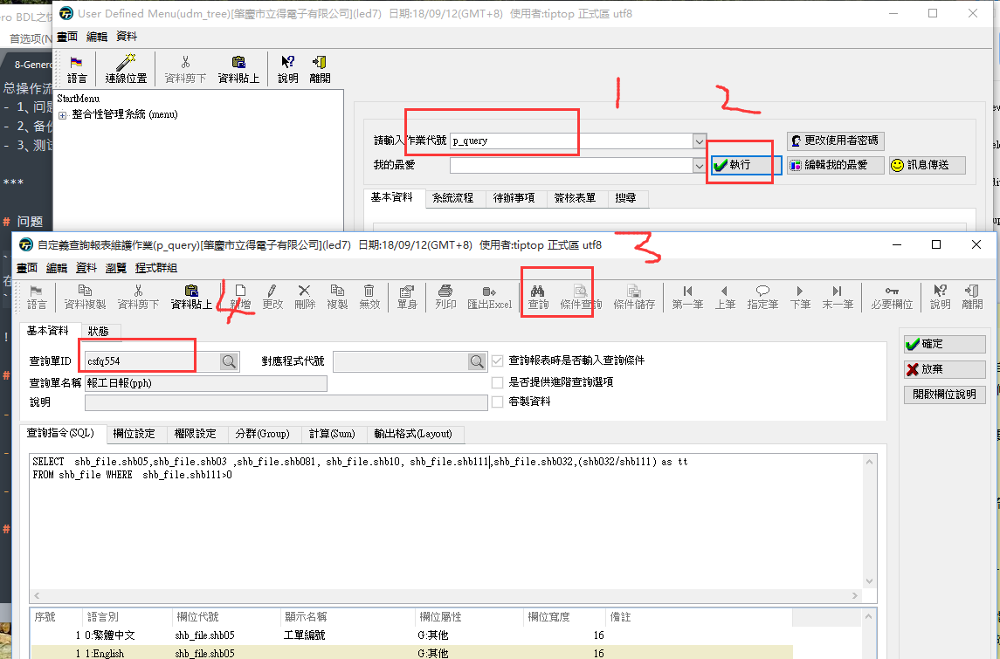
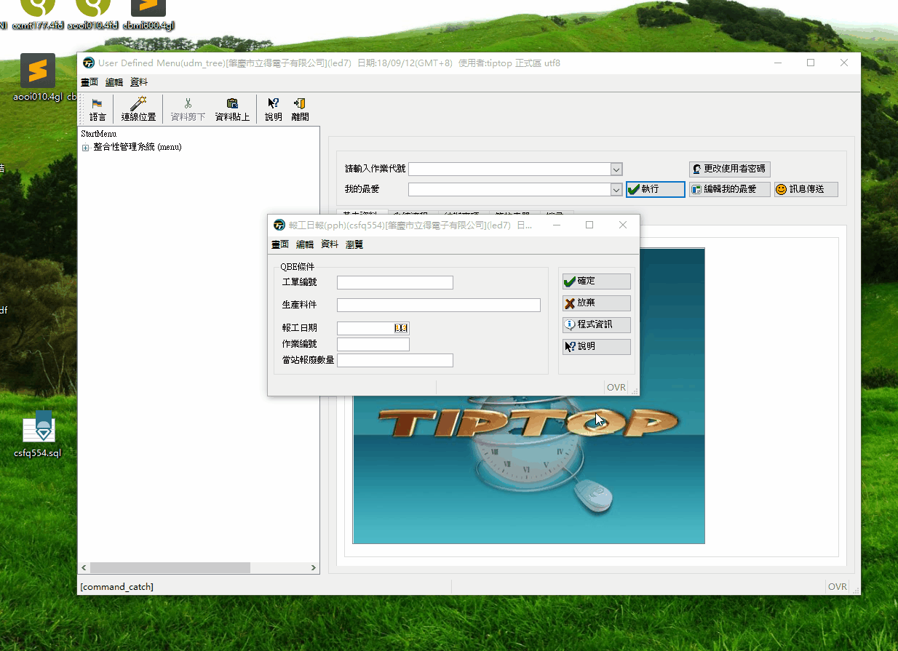

总操作流程：
- 1、[问题](#tiptop-01)
- 2、[备份、修改](#tiptop-02)
- 3、[测试](#tiptop-03)

***

# <a name="tiptop-01" href="#" >问题</a>

```
在csfq554中添加一个栏位
```



# <a name="tiptop-02" href="#" >备份、修改</a>

- 1、进入程序



- 2、备份

`将sql备份写一份csfq554.sql备份到T:\topprod\tiptop文件夹下`

- 3、修改

`将sql修改成：SELECT  shb_file.shb05,shb_file.shb03 ,shb_file.shb081, shb_file.shb10, shb_file.shb111,shb_file.shb112,shb_file.shb032 FROM shb_file`

# <a name="tiptop-03" href="#" >测试</a>

