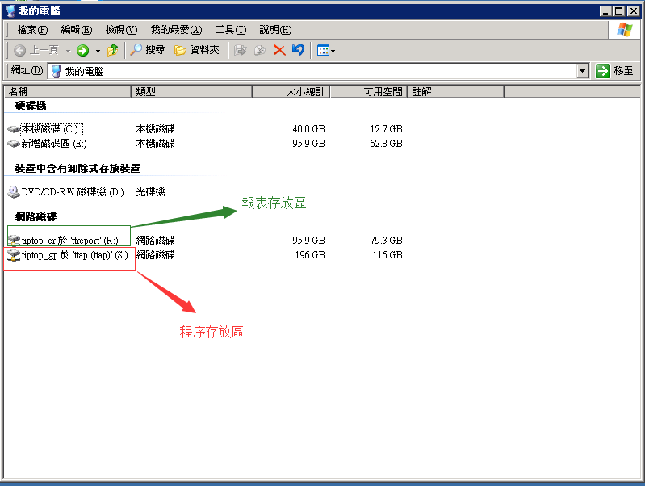
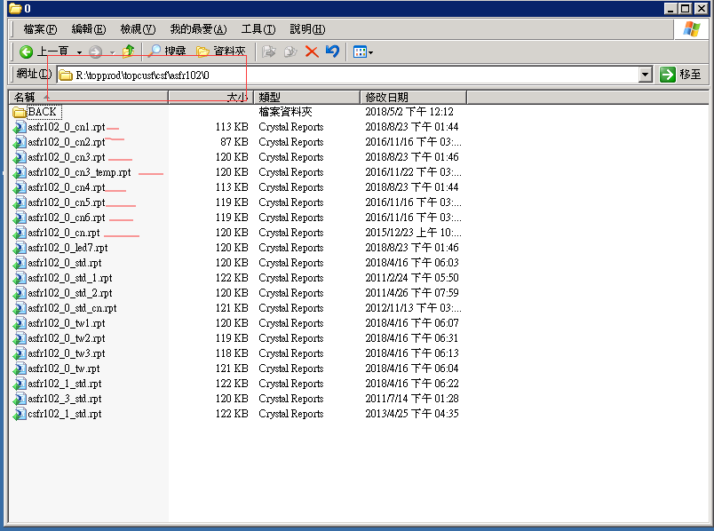
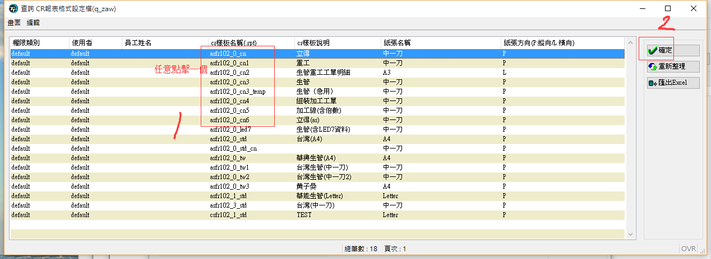
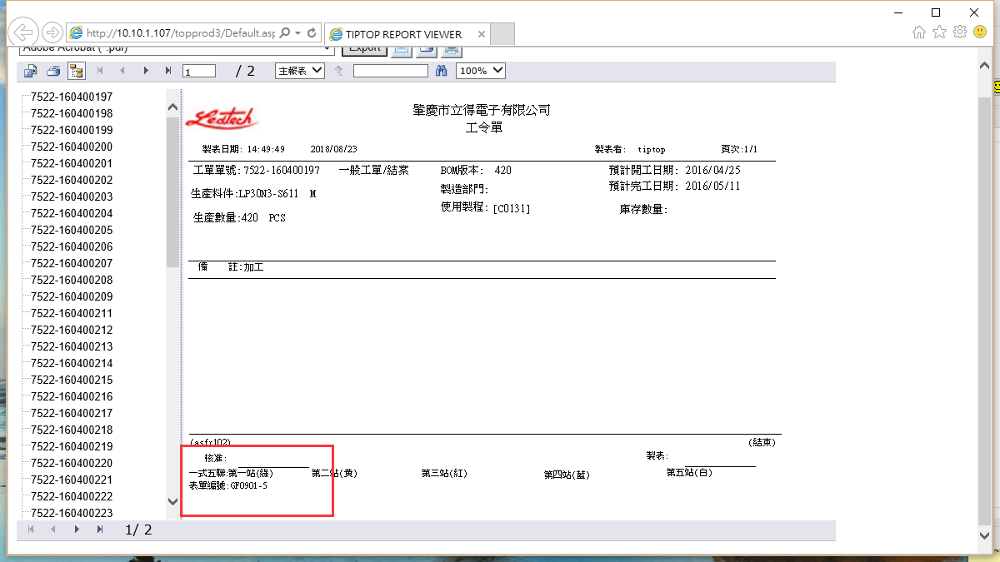

本業目錄：
- 1、[修改報表的字段](#tiptop-01)
    - 1.[1、問題](#tiptop-01-01)
    - 1.[2、找到報表](#tiptop-01-02)
    - 1.[3、修改單編號](#tiptop-01-03)
    - 1.[4、看效果](#tiptop-01-04)

***

`注意：報表的不需要運行命令就可以使命令生效`

# <a name="tiptop-01" href="#" >修改報表的字段</a>

### <a name="tiptop-01-01" href="#" >1、問題</a>

- 原來：

報表：asfr102_0_cn系列

表單編號：GF1503-6

- 改：

系列的報表表單編號改成：GF0901-5

### <a name="tiptop-01-02" href="#" >2、找到報表</a>

### <a name="tiptop-01-03" href="#" > 3、修改單編號</a>

### <a name="tiptop-01-04" href="#" >4、看效果</a>

