本業目錄:
- 1、新建一支程序
    - 1.1、問題
    - 1.2、erp登錄測試區的客制區
    - 1.3、修改文件，移動文件，執行文件
    - 1.4、erp給新程序權限
    - 1.5、看效果

***

# 新建一支程序

### 1、問題
`
以caxmr411為模板製作出新的一個程序出來caxmr413
`

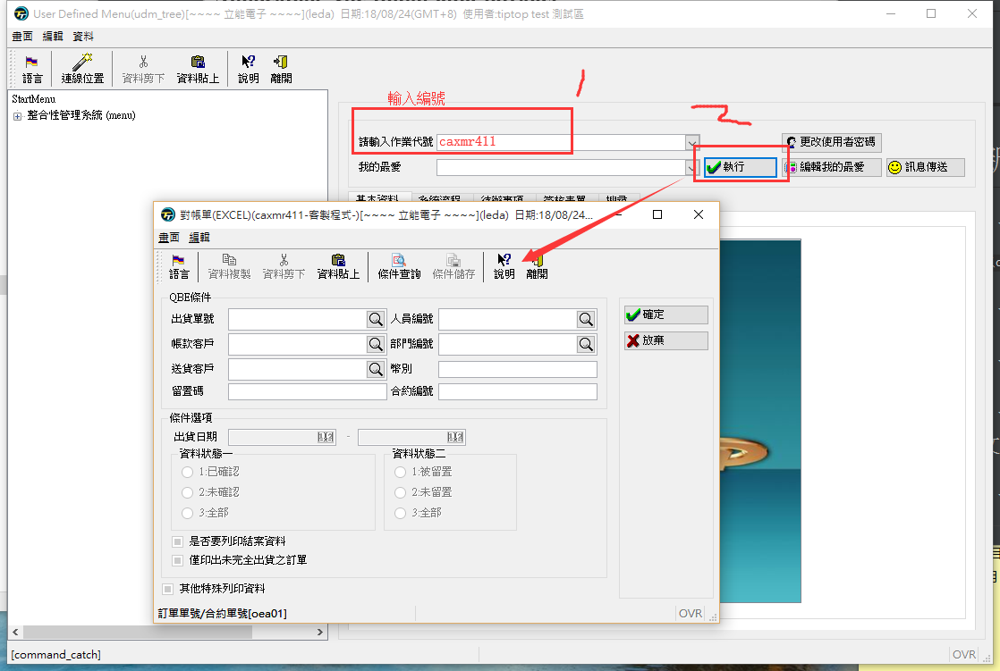

### 2、erp登錄測試區的測試區

- 使用gdc創建一個進測試區的ERP登錄界面


```
http://10.10.1.106/cgi-bin/fglccgi/wa/r/gdc-toptest-udm-intranet
```

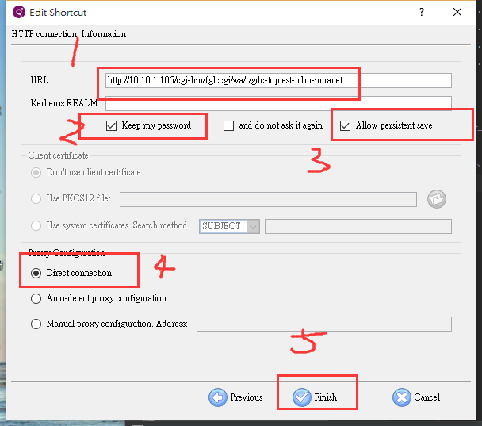


- erp登錄進客制區的erp

```
用戶名：tiptop

密碼：tiptop
```
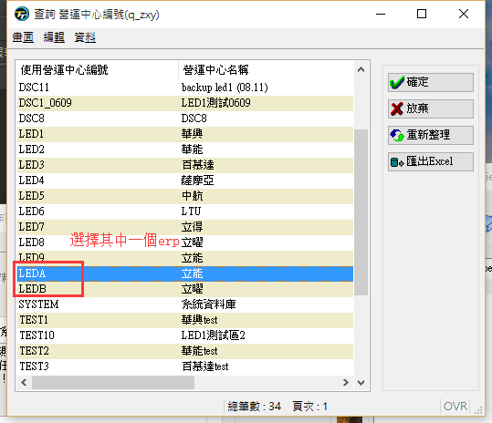

`選擇對應的系統`


- ssh登錄進入測試區的克制區

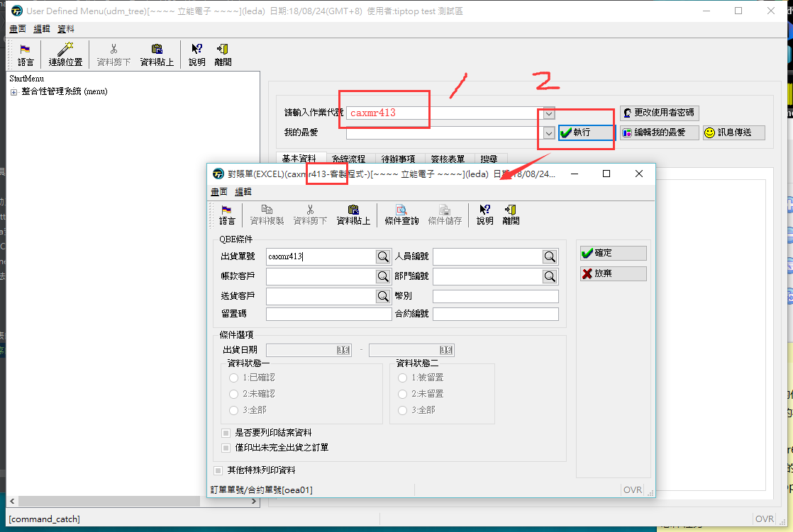

### 3、修改文件，移動文件，執行文件

- 修改文件

1、複製一份caxmr411.4gl，將名字修改成caxmr413.4gl，程序裡面的caxmr411字符串修改成caxmr413

2、複製一份caxmr411.4fd，將名字修改成caxmr413.4fd

- 移動文件

1、將將caxmr413.4gl文件移到/u1/toptest/topcust/cxm/4gl文件夾下

2、將caxmr413.4fd文件移到/u1/toptest/topcust/cxm/4fd文件夾下

- 執行文件

1、進入4gl的文件夾執行r.c2 caxmr413

2、進入4fd的文件夾執行r.f2 caxmr413

### 4、erp給新程序設置權限

- 給新程序授運行路徑權限

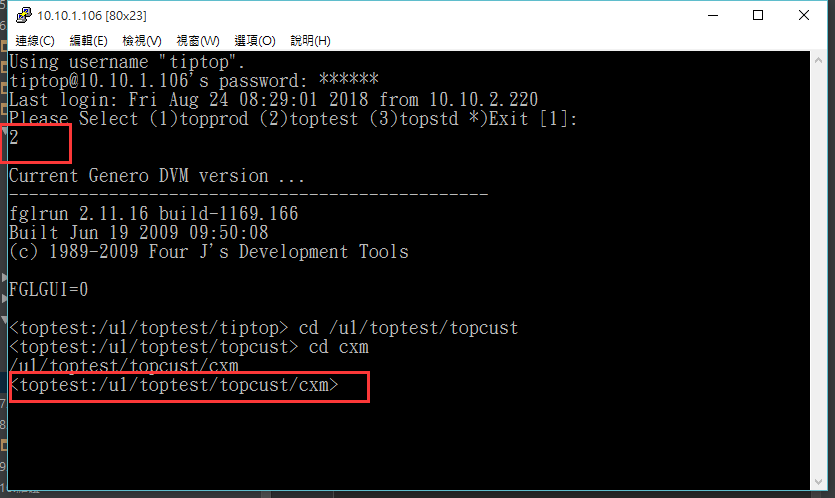

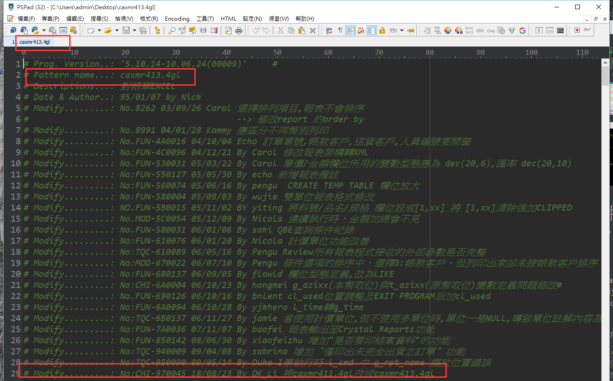

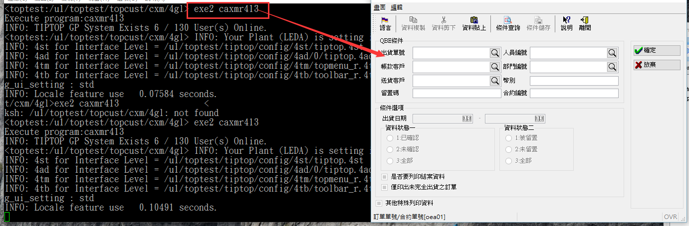

- 給新程序授畫面權限

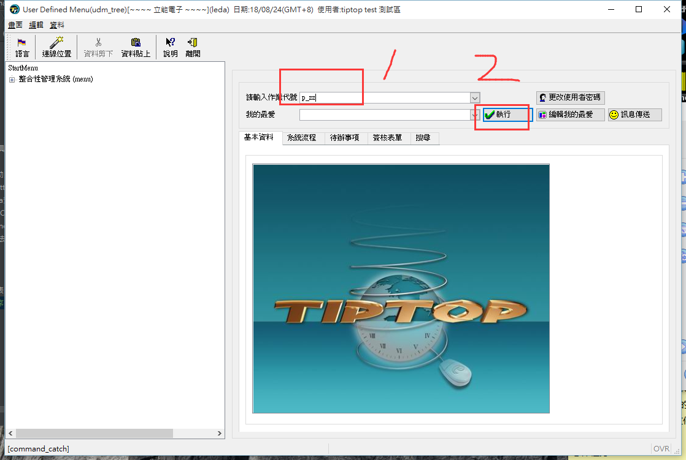

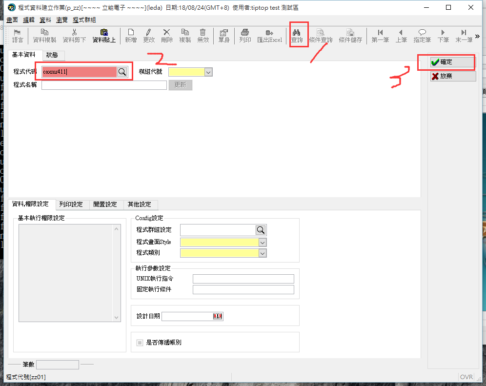

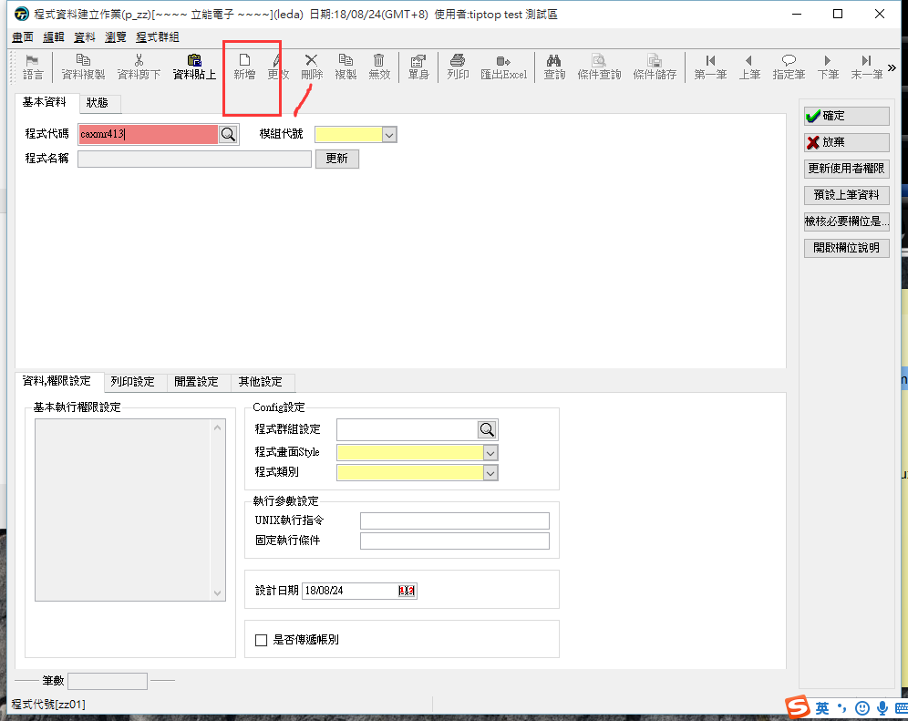


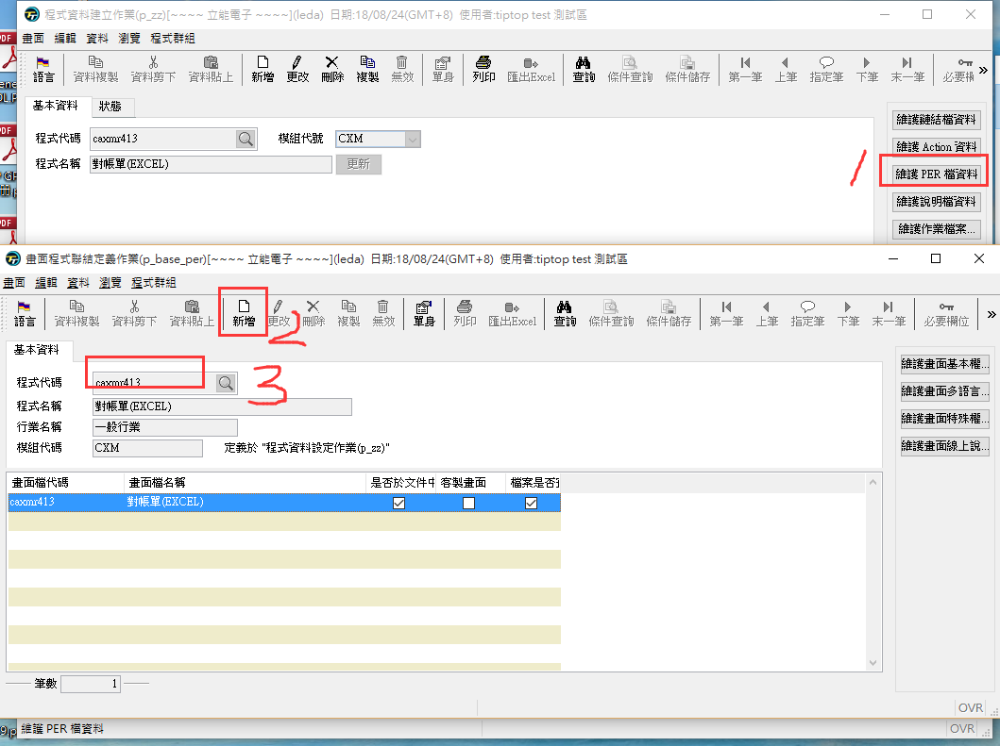

- 看畫面設置是否成功

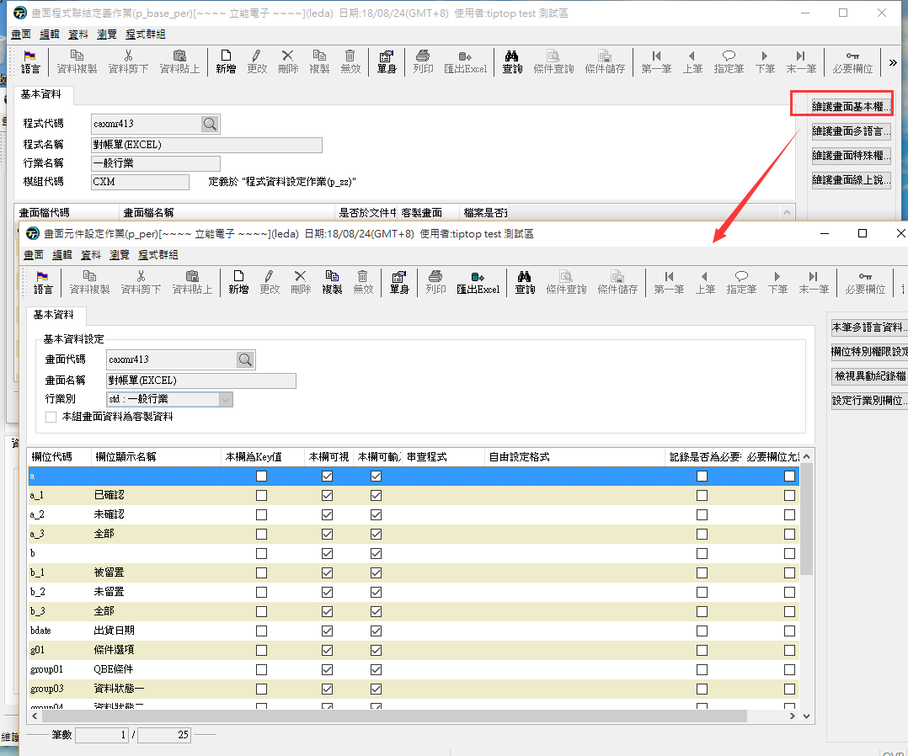


- 記得更新

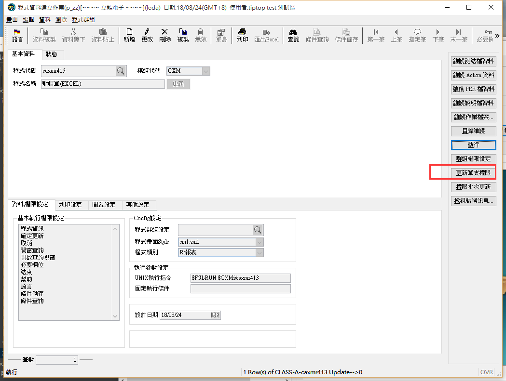

### 5、看效果

- 方式一

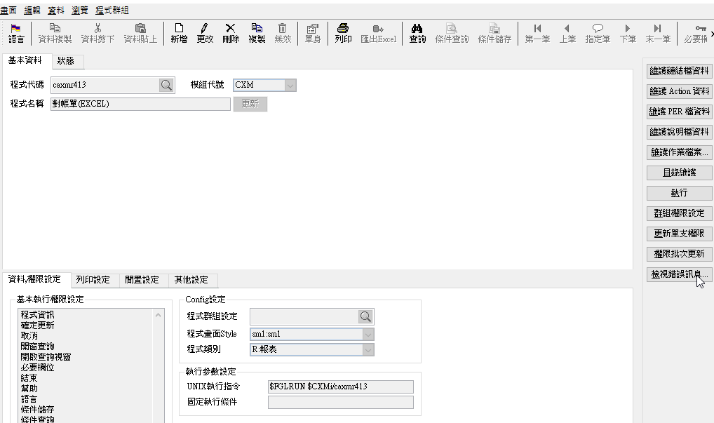

- 方式二


- 方式三

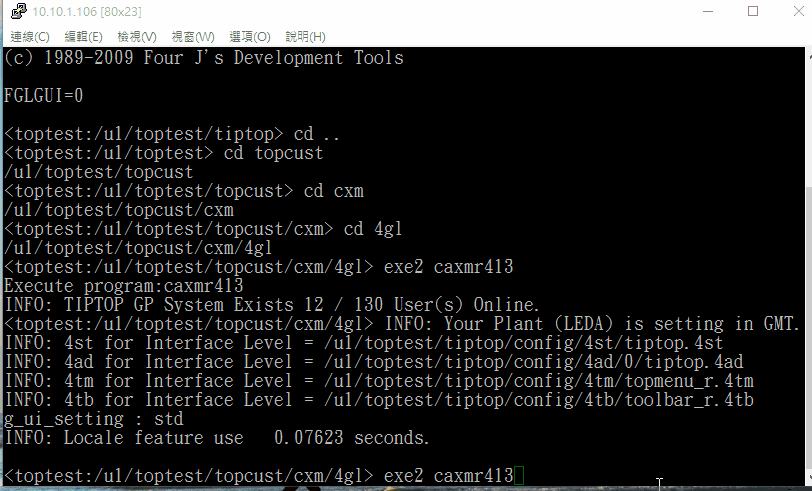


