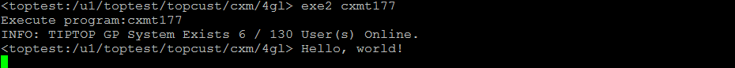

操作总流程：
- 1、[创建文件](#4gl-01)
- 2、[写程序和执行程序](#4gl-02)
- 3、[给程序执行权限](#4gl-03)
- 4、[执行看效果](#4gl-04)

***

# <a name="4gl-01" href="#" >创建文件</a>

-  在克制区里创建一支新的程序 cxmt177.4gl

# <a name="4gl-02" href="#" >写程序和执行程序</a>

- 写程序
```
DATABASE ds

GLOBALS "../../../tiptop/config/top.global"

# 主函數
MAIN
    DISPLAY "Hello, world!"
END MAIN
```
- 执行程序

進入4gl的文件夾執行r.c2 cxmt177

# <a name="4gl-03" href="#" >给程序执行权限</a>

p_zz下模仿cxmt800的给cxmt177程序[授運行路徑权限](https://github.com/OurNotes/CCN/blob/master/6.%E5%90%8E%E5%8F%B0/4.Genero%20BDL/5.Genero%20BDL%E4%B9%8Btiptop%E5%AE%9E%E6%93%8D/5-Genero%20BDL%E4%B9%8B%E5%8F%AA%E6%94%B9%E7%A8%8B%E5%BA%8F.md#tiptop-04)

# <a name="4gl-04" href="#" >执行看效果</a>

```
exe2 cxmt177
```


