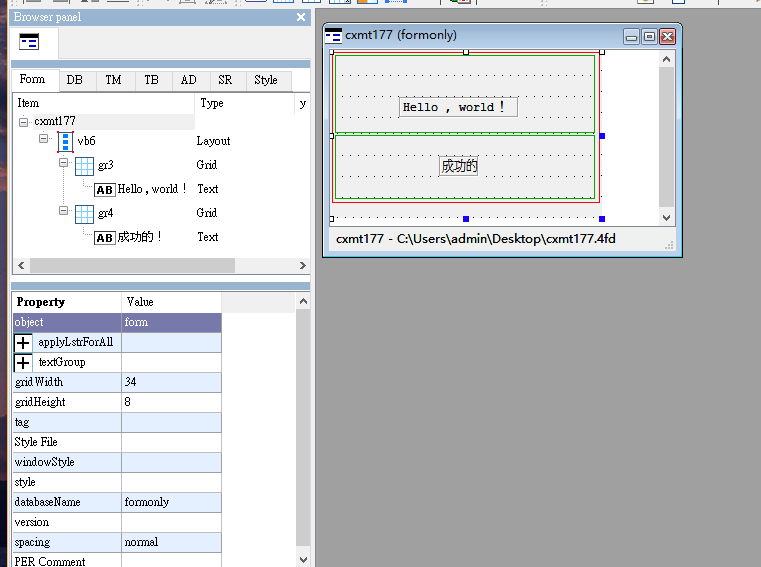

總操作流程:
- 1、創建4fd
- 2、寫4gl程序
- 3、erp給新程序權限
- 4、看效果

***

# 創建4fd

[](https://pan.baidu.com/s/17Pwu6ymt7q2lUzOKhrKBGQ)



# 寫4gl程序

```
DATABASE ds  -- 鏈接數據庫

GLOBALS "../../../tiptop/config/top.global" -- 引用全域文件

DEFINE g_curs_index          LIKE type_file.num10
DEFINE g_row_count           LIKE type_file.num10

MAIN

  # 定義局域變量，本文函數可以用
  DEFINE p_row,p_col     LIKE type_file.num5

  # 命令頁下取值
  LET p_row = ARG_VAL(1)
  LET p_col = ARG_VAL(2)

  CALL  cl_used(g_prog,g_time,1) RETURNING g_time   -- 計算使用時間 (進入時間)

  # 打開窗口
  LET p_row = 5 LET p_col = 10  -- 給變量賦值
  OPEN WINDOW t177_w AT p_row,p_col WITH FORM "cxm/42f/cxmt177"
    ATTRIBUTE (STYLE = g_win_style CLIPPED)
    CALL cl_ui_init()     -- 初始化程序設定
    LET g_action_choice = "" -- 初始化變量
    CALL t177_menu()  -- 調用i010_menu函數
  CLOSE WINDOW t177_w

  CALL  cl_used(g_prog,g_time,2) RETURNING g_time    -- 計算使用時間 (退出時間)

END MAIN

# 畫面：ToolBar的設置函數
FUNCTION t177_menu()

    DEFINE l_cmd  LIKE type_file.chr1000

    # ToolBar的設置
    MENU ""
        BEFORE MENU
           CALL cl_navigator_setting(g_curs_index, g_row_count)  -- 重新設定TOOLBAR上的『上筆、跳筆、下筆』等五個按鍵是否可用 / 不可用。

        ON ACTION insert -- 當ToolBar觸發添加按鈕的時候執行相應的業務處理
            DISPLAY "insert!"
        ON ACTION query -- 觸發查詢按鈕
            DISPLAY "query!"
        ON ACTION modify  -- 觸發修改按鈕
            DISPLAY "modify!"
        ON ACTION invalid  -- 觸發無效按鈕
            DISPLAY "invalid!"
        ON ACTION delete -- 觸發刪除按鈕
            DISPLAY "delete!"
       ON ACTION reproduce  -- 觸發打印按鈕
            DISPLAY "reproduce!"
        ON ACTION exit   -- 觸發離開按鈕
            LET g_action_choice = "exit"
            EXIT MENU
        COMMAND KEY(INTERRUPT)
            LET INT_FLAG=FALSE
            LET g_action_choice = "exit"
            EXIT MENU
    END MENU
END FUNCTION
```

# erp給新程序權限

[給新程序授運行路徑和序授畫面權限](https://github.com/OurNotes/CCN/blob/master/6.%E5%90%8E%E5%8F%B0/4.Genero%20BDL/3.Genero%20BDL%E4%B9%8Btiptop%E5%BF%AB%E9%80%9F%E7%86%9F%E6%82%89/5-Genero%20BDL%E4%B9%8B%E5%8F%AA%E6%94%B9%E7%A8%8B%E5%BA%8F.md#tiptop-04)

# 看效果


