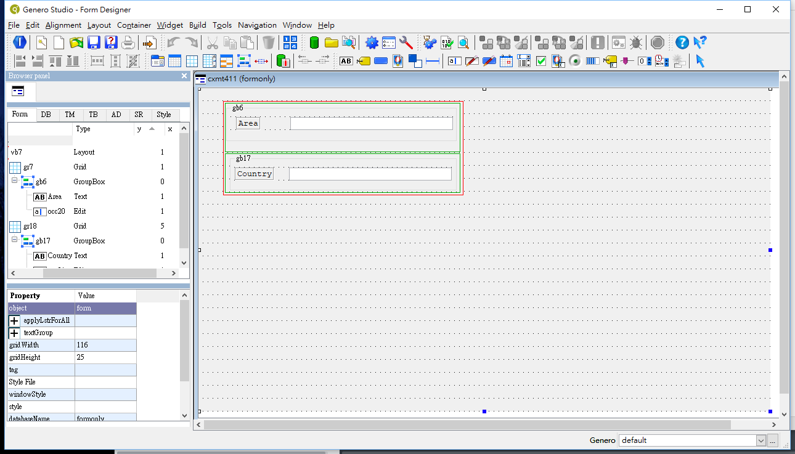
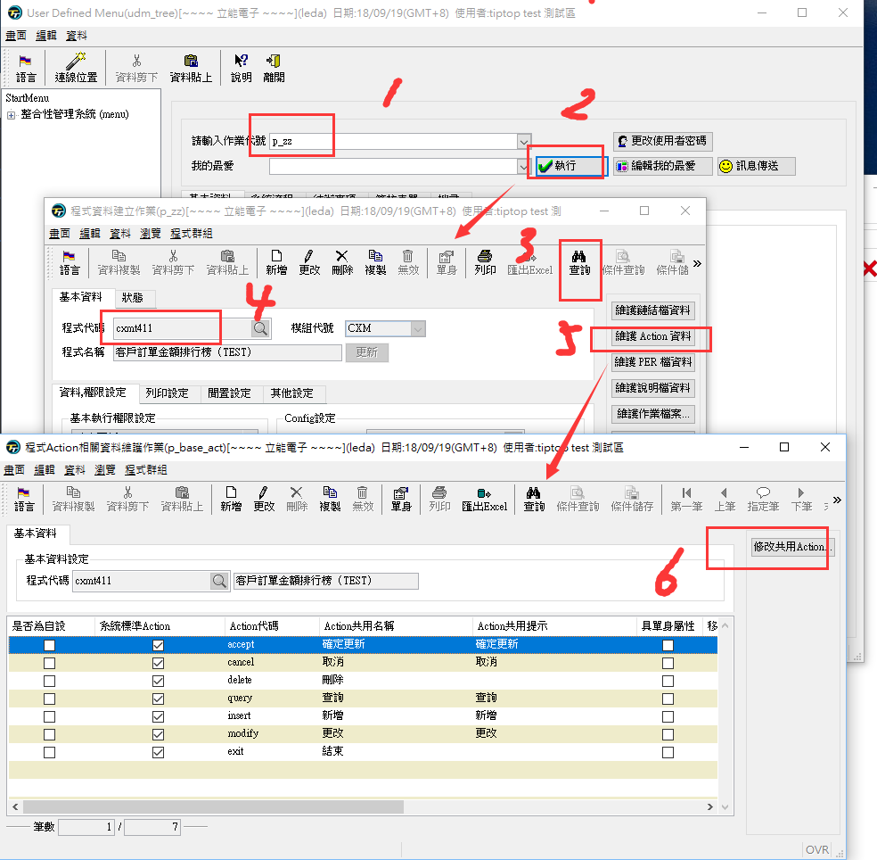
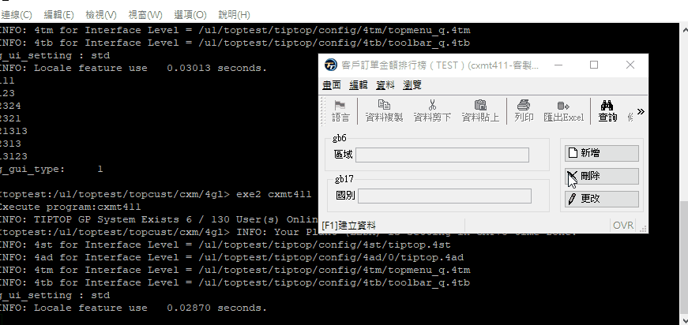

總操作流程:
- 1、創建4fd
- 2、寫4gl程序
- 3、erp給新程序權限
- 4、看效果

***

# 創建4fd
[](https://pan.baidu.com/s/1AN-VD7iMs1b1c8BW5U5t1A)



# 寫4gl程序

```
DATABASE ds  -- 連接數據庫

GLOBALS "../../../tiptop/config/top.global" -- 調用請全域文件

# 定義全局變量，本文件所有可以用
DEFINE p_row                 LIKE type_file.num5,
       p_col                 LIKE type_file.num5,
       g_curs_index          LIKE type_file.num10,
       g_row_count           LIKE type_file.num10,
       g_before_input_done   LIKE type_file.num5

# 定義全局變量的集合，本文件所有可以用(類似Java的model)
DEFINE g_oeb                 RECORD LIKE occ_file.*

{
 作用：主函数
}
MAIN
   #計算被使用時間
   DEFINE l_time   LIKE type_file.chr8
   # 改变一些系统缺省值
   OPTIONS
      FORM LINE     FIRST + 2,
      MESSAGE LINE  LAST,
      PROMPT LINE   LAST,
      INPUT NO WRAP
   DEFER INTERRUPT

   #  cl_user( ) 主要在抓取系統中與『個人設定』相關的變數值資料，如g_user，g_clas，g_grup等等。
   IF (NOT cl_user()) THEN
      EXIT PROGRAM
   END IF

   #當發生 SQL 錯誤時，系統會CALL cl_err_msg_log()，注意此處 CALL 的寫法與他處不同，不可加括號。
   WHENEVER ERROR CALL cl_err_msg_log

   # cl_setup( ) 主要在抓取系統中與『模組設定』相關的變數值資料，如這個模組所必需的全域變數等等。
   IF (NOT cl_setup("CXM")) THEN
      EXIT PROGRAM
   END IF

   # 計算使用時間 (進入時間)
   CALL cl_used(g_prog,l_time,1) RETURNING l_time

   # 鏈接4fd，打開畫面黨
   LET p_row = 2 LET p_col = 9
   OPEN WINDOW t411_w AT p_row,p_col WITH FORM "cxm/42f/cxmt411"
      ATTRIBUTE (STYLE = g_win_style CLIPPED)

      CALL cl_set_locale_frm_name("cxmt411")

      # 初始化程序設定
      CALL cl_ui_init()

      LET g_action_choice = "" -- 初始化變量

      CALL t411_menu()

   CLOSE WINDOW t400_w

   #計算使用時間 (退出時間)
   CALL cl_used(g_prog,l_time,2)  RETURNING l_time

END MAIN

{
 作用：导航栏目的函数
}
FUNCTION t411_menu()

    DEFINE l_cmd  LIKE type_file.chr1000

    # ToolBar的設置
    MENU ""
        BEFORE MENU
           CALL cl_navigator_setting(g_curs_index, g_row_count)  -- 重新設定TOOLBAR上的『上筆、跳筆、下筆』等五個按鍵是否可用 / 不可用。
        ON ACTION insert -- 當ToolBar觸發添加按鈕的時候執行相應的業務處理
            LET g_action_choice="insert"  -- 告知要判斷的權限項目。
            IF cl_chk_act_auth() THEN  -- cl_chk_act_auth( )判斷執行使用者 (g_user) 所屬的群組 (g_grup) 在本作業 (g_prog) 是否有可執行的權利或作業項目
                 CALL t411_a() -- 調用函數
            END IF
        ON ACTION delete -- 觸發刪除按鈕
            LET g_action_choice="delete"
            DISPLAY g_action_choice
        ON ACTION query -- 觸發查詢按鈕
            LET g_action_choice="query"
            DISPLAY g_action_choice
        ON ACTION modify  -- 觸發修改按鈕
            LET g_action_choice="modify"
            DISPLAY g_action_choice
        ON ACTION exit   -- 觸發離開按鈕
            LET g_action_choice = "exit"
            EXIT MENU
        COMMAND KEY(INTERRUPT)
            LET INT_FLAG=FALSE
            LET g_action_choice = "exit"
            EXIT MENU
    END MENU

END FUNCTION

{
  作用：做新增的函數
}
FUNCTION t411_a()

    MESSAGE ""  -- 信息显示的位置

    CLEAR FORM

    WHILE TRUE
        CALL t411_i("a") -- 調用函數

        # 若按了DEL鍵做的相應業務處理
        IF INT_FLAG THEN
            LET INT_FLAG = 0
            CALL cl_err('',9001,0)
            CLEAR FORM
            EXIT WHILE
        END IF
    END WHILE

END FUNCTION

{
  作用：做傳入的函數
}
FUNCTION t411_i(p_cmd)
  DEFINE p_cmd     LIKE type_file.chr1,
         l_input   LIKE type_file.chr1

  input by name g_oeb.occ20 WITHOUT DEFAULTS
        BEFORE INPUT
              LET l_input='N'
              LET g_before_input_done = FALSE
              CALL t411_set_entry(p_cmd)
              CALL t411_set_no_entry(p_cmd)
              LET g_before_input_done = TRUE

        AFTER FIELD occ20
              display g_oeb.occ20
  END INPUT

END FUNCTION


{
  作用：輸入框可以編輯的函數
}

FUNCTION t411_set_entry(p_cmd)

   DEFINE p_cmd LIKE type_file.chr1
   IF p_cmd = 'a'  AND (NOT g_before_input_done) THEN
        CALL cl_set_comp_entry("occ20",TRUE)
   END IF
END FUNCTION


{
  作用：輸入框不可以編輯的函數
}
FUNCTION t411_set_no_entry(p_cmd)
   DEFINE p_cmd LIKE type_file.chr1
   IF p_cmd = 'a'  AND (NOT g_before_input_done) THEN
        CALL cl_set_comp_entry("occ21",FALSE)
   END IF
END FUNCTION

```

# erp給新程序權限

- 1、[給新程序授運行路徑和序授畫面權限](https://github.com/OurNotes/CCN/blob/master/6.%E5%90%8E%E5%8F%B0/4.Genero%20BDL/3.Genero%20BDL%E4%B9%8Btiptop%E5%BF%AB%E9%80%9F%E7%86%9F%E6%82%89/5-Genero%20BDL%E4%B9%8B%E5%8F%AA%E6%94%B9%E7%A8%8B%E5%BA%8F.md#tiptop-04)

- 2、給程序增刪查改按鈕權限




# 看效果

