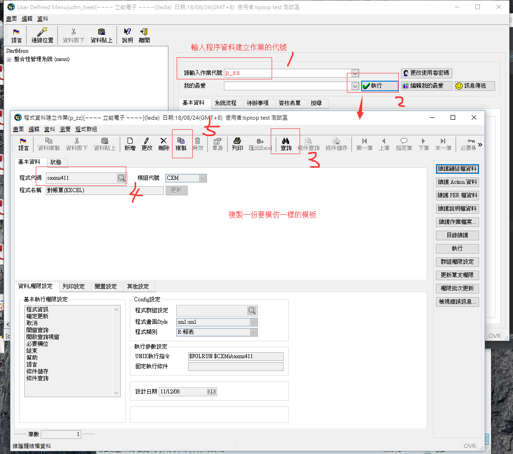
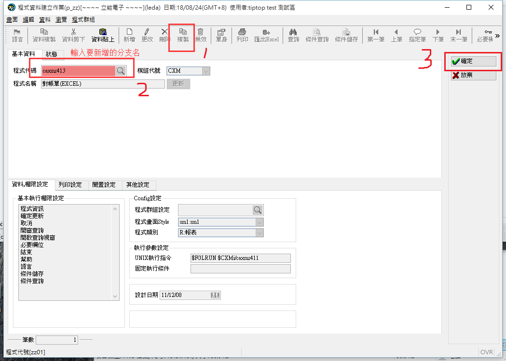
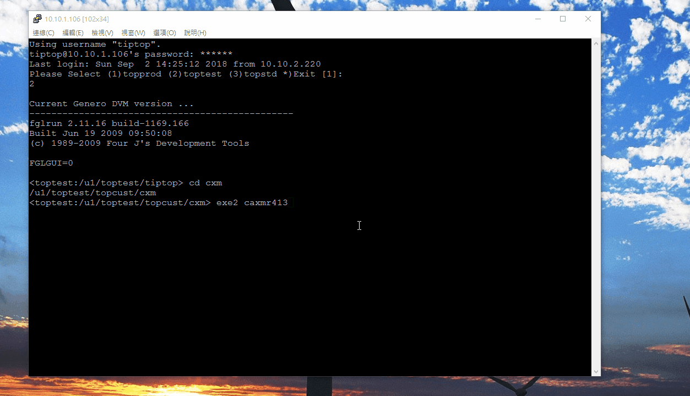

本業目錄:
- 1、[模仿客制区中的程序，新建一支程序](#tiptop-01)
    - 1.[1、問題](#tiptop-01-01)
    - 1.[2、erp登錄測試區的客制區](#tiptop-01-02)
    - 1.[3、修改文件，移動文件，執行文件](#tiptop-01-03)
    - 1.[4、erp給新程序權限](#tiptop-01-04)
    - 1.[5、看效果](#tiptop-01-05)

- 2、[模仿標準區中的程序，新建一支程序](#tiptop-02)
    - 2.[1、问题](#tiptop-02-01)
    - 2.[2、复制程序、修改程序、移動程序、執行程序](#tiptop-02-01)
    - 2.[3、erp給新程序權限](#tiptop-02-01)
    - 2.[4、看效果](#tiptop-02-01)

***

# <a name="tiptop-01" href="#" >模仿客制区中的程序，新建一支程序</a>

### <a name="tiptop-01-01" href="#" >1、問題</a>
`
以caxmr411為模板製作出新的一個程序出來caxmr413
`


### <a name="tiptop-01-02" href="#" >2、erp登錄測試區的測試區</a>

- 使用gdc創建一個進測試區的ERP登錄界面


```
http://10.10.1.106/cgi-bin/fglccgi/wa/r/gdc-toptest-udm-intranet
```


- erp登錄進客制區的erp

```
用戶名：tiptop

密碼：tiptop
```


`選擇對應的系統`


- ssh登錄進入測試區的克制區


### <a name="tiptop-01-03" href="#" >3、修改文件，移動文件，執行文件</a>

- 修改文件

1、從/u1/toptest/topcust/cxm/4gl中複製一份caxmr411.4gl，將名字修改成caxmr413.4gl，程序裡面的caxmr411字符串修改成caxmr413

2、從/u1/toptest/topcust/cxm/4fd中複製一份caxmr411.4fd，將名字修改成caxmr413.4fd,打开4fd的文件修改textGroup的text的名称

- 移動文件

1、將將caxmr413.4gl文件移到/u1/toptest/topcust/cxm/4gl文件夾下

2、將caxmr413.4fd文件移到/u1/toptest/topcust/cxm/4fd文件夾下

- 執行文件

1、進入4gl的文件夾執行r.c2 caxmr413

2、進入4fd的文件夾執行r.f2 caxmr413

### <a name="tiptop-01-04" href="#" >4、erp給新程序設置權限</a>

- 給新程序授運行路徑權限






- 給新程序授畫面權限


- 看畫面設置是否成功


- 記得更新


### <a name="tiptop-01-05" href="#" >5、看效果</a>

- 方式一


- 方式二


- 方式三



# <a name="tiptop-02" href="#" >模仿標準區中的程序，新建一支程序</a>

### <a name="tiptop-02-01" href="#" >1、問題</a>
```
以axmr610為模板創建一支cxmr611
```
### <a name="tiptop-02-02" href="#" >2、复制程序、修改程序、移動程序、執行程序</a>

- 複製程序
1、從/u1/tiptest/tiptop/axm/4gl中複製一份axmr610.4gl，將名字修改成cxmr611.4gl

2、從/u1/tiptest/tiptop/axm/4fd中複製一份axmr610.4fd，將名字修改成cxmr611.4fd，打开4fd的文件修改textGroup的text的名称

- 修改程序
1、修改引用頭文件的路徑:GLOBALS "../../config/top.global"，改成：GLOBALS "../../../tiptop/config/top.global"

2、修改字符串：將axmr610字符串修改成cxmr611

3、修改路徑：將"axm/42f/axmr610"，改成："cxm/42f/cxmr611"

- 移動程序

1、將cxmr611.4fd程序移動到/u1/tiptest/topcust/cxm/4fd 下

2、將cxmr611.4gl程序移動到/u1/tiptest/topcust/cxm/4gl 下

- 執行程序

1、切换到4gl的文件夹下执行：r.c2 cxmr611

2、切换到4fd文件夹下执行：r.f2 cxmr611

### <a name="tiptop-02-03" href="#" >3、erp給新程序權限</a>

操作流程和第一个差不多

### <a name="tiptop-02-04" href="#" >4、看效果</a>

操作流程和第一个差不多


