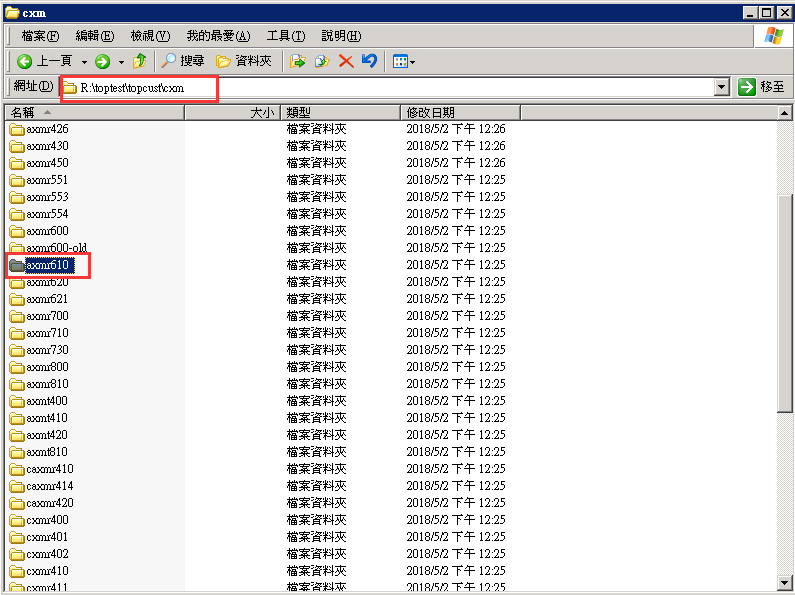
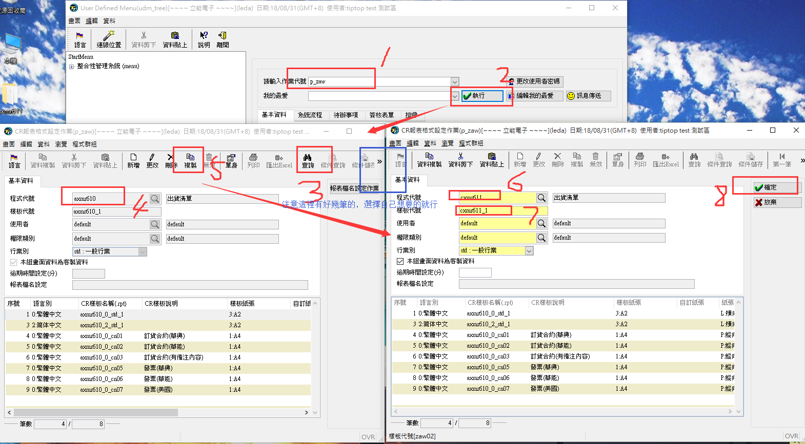
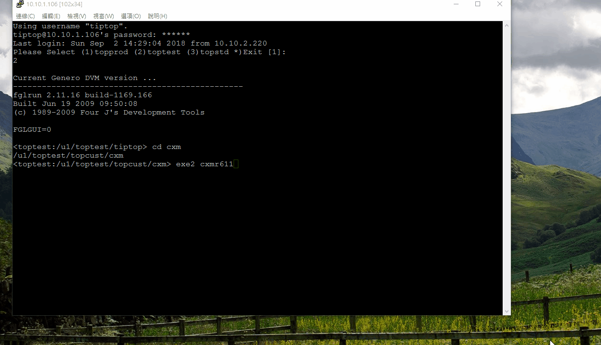

本業目錄:
- [1、問題](#tiptop-01)
- [2、复制、修改、移動、執行程序](#tiptop-02)
- [3、erp給新程序權限](#tiptop-03)
- [4、看效果](#tiptop-04)

***

# <a name="tiptop-01" href="#" >1、問題</a>
```
以axmr610為模板創建一支cxmr611
```
# <a name="tiptop-02" href="#" >2、复制、修改、移動、執行程序</a>

- 複製
1、複製4gl：從/u1/tiptest/tiptop/axm/4gl中複製一份axmr610.4gl

2、複製4fd：從/u1/tiptest/tiptop/axm/4fd中複製一份axmr610.4fd

3、複製報表：到報表處拷貝一份axmr610的



- 修改

### 1、修改4gl
1、修改引用頭文件的路徑:GLOBALS "../../config/top.global"，改成：GLOBALS "../../../tiptop/config/top.global"

2、修改axmr610：將含有axmr610的修改成cxmr611

3、修改模組：將含有axm的修改成cxm

### 2、修改4fd

1、將含有axmr610的修改成cxmr611

### 3、修改报表

1、將含有axmr610的修改成cxmr611

- 移動

1、移動4gl：將cxmr611.4gl程序移動到/u1/tiptest/topcust/cxm/4gl 下

2、移動4fd：將cxmr611.4fd程序移動到/u1/tiptest/topcust/cxm/4fd 下

3、移動報表：將cxmr611文件夾移動到R:\toptest\topcust\cxm 下

- 執行

1、執行4gl：切换到4gl的文件夹下执行：r.c2 cxmr611

2、執行4fd：切换到4fd文件夹下执行：r.f2 cxmr611

# <a name="tiptop-03" href="#" >3、erp給新程序權限</a>

1、給新程序授運行路徑和序授畫面權限是和上一節一樣的

2、給報表權限




# <a name="tiptop-04" href="#" >4、看效果</a>

- 1、看程序



- 2、看報表（要选择有数据的日期）


