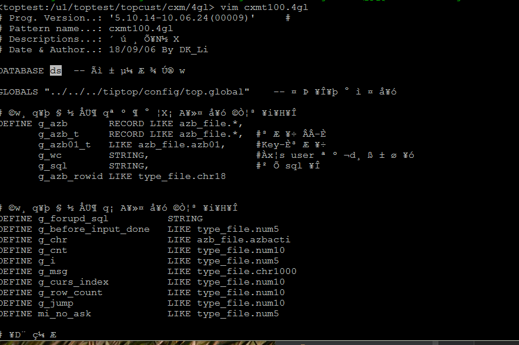
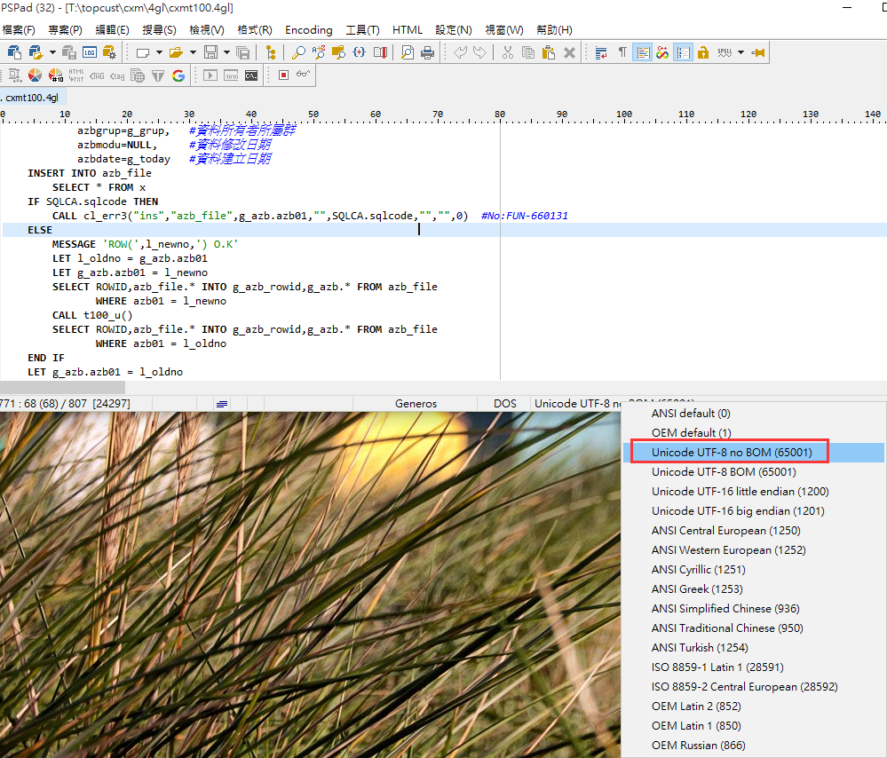

# 错误信息
```
../42m/cxm_cxmt100.4gl:3: An invalid multibyte character has been encountered.
An error occurred while preprocessing the file ../42m/cxm_cxmt100.4gl. Compilation ends.
../42m/cxm_cxmt100.4gl:3: An invalid multibyte character has been encountered.
An error occurred while preprocessing the file ../42m/cxm_cxmt100.4gl. Compilation ends.
```


# 检查



# 解决

`將編碼改正確就對了`



# 看效果

