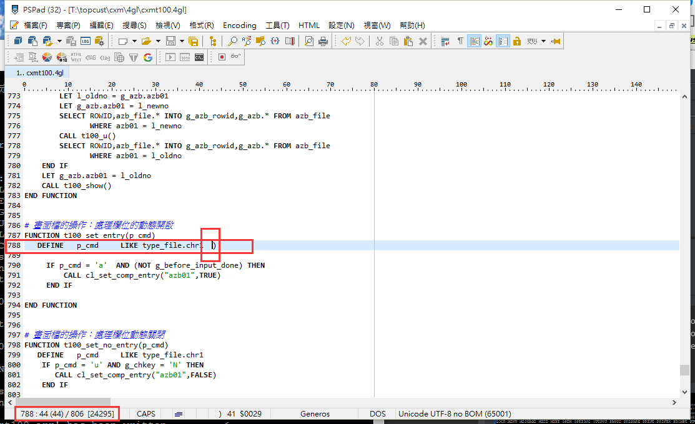

本页目录：
- 1、[错误信息](#debug-01)
- 2、[检查](#debug-02)
- 3、[解决](#debug-03)
- 4、[看效果](#debug-04)

***

# 错误信息

```
../42m/cxm_cxmt100.4gl:788:44:788:44:error:(-6609) A grammatical error has been found at ')' expecting: ACCEPT ALTER BEGIN BREAKPOINT CANCEL CALL CASE CLEAR CLOSE COMMIT CONNECT CONSTANT CONSTRUCT CONTINUE CREATE DATABASE DECLARE DEFER DEFINE DELETE DIALOG DISPLAY DISCONNECT DROP END ERROR EXECUTE EXIT FETCH FINISH FLUSH FOR FOREACH FREE GO GOTO GRANT HIDE IF INITIALIZE INPUT INSERT LABEL LET LOAD LOCATE LOCK MENU MESSAGE NEED NEXT OPEN OPTIONS OUTPUT PAUSE PREPARE PRINT PRINTX PROMPT PUT RECOVER RENAME RETURN REVOKE ROLLBACK ROLLFORWARD RUN SCROLL SET SHOW SKIP SLEEP START TRUNCATE TRY UNLOAD UNLOCK UPDATE VALIDATE WHENEVER WHILE TERMINATE TYPE CURRENT_WINDOW SWITCH_TO_SELECT.
The compilation was not successful.  Errors found: 1.
 The file '../42m/cxm_cxmt100.err' has been written.

```


# 检查



# 解决

刪掉多餘的")"

# 看效果

```
輸入命令：r.c2 cxmt100
```

