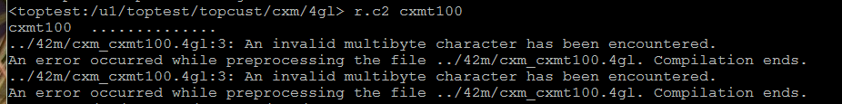

本页目录：
- 1、[错误信息](#debug-01)
- 2、[检查](#debug-02)
- 3、[解决](#debug-03)
- 4、[看效果](#debug-04)

***

# <a name="debug-01" href="#" >错误信息</a>
```
../42m/cxm_cxmt100.4gl:3: An invalid multibyte character has been encountered.
An error occurred while preprocessing the file ../42m/cxm_cxmt100.4gl. Compilation ends.
../42m/cxm_cxmt100.4gl:3: An invalid multibyte character has been encountered.
An error occurred while preprocessing the file ../42m/cxm_cxmt100.4gl. Compilation ends.
```



# <a name="debug-02" href="#" >检查</a>


# <a name="debug-03" href="#" >解决</a>

`將編碼改正確就對了`


# <a name="debug-04" href="#" >看效果</a>

