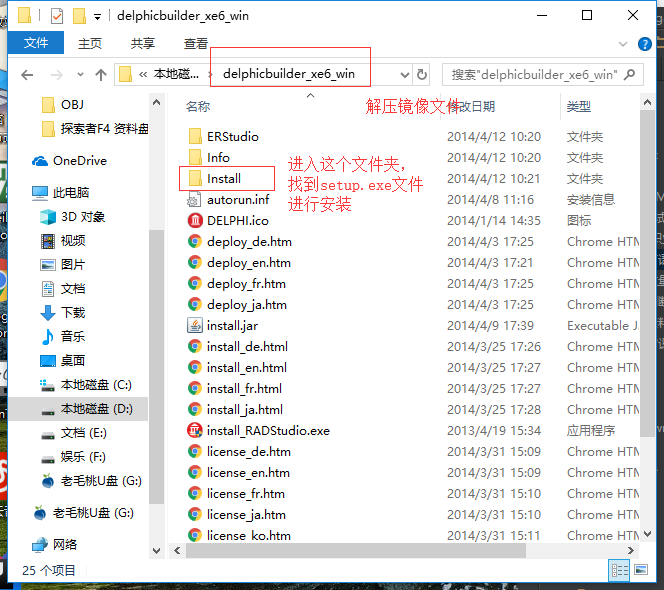
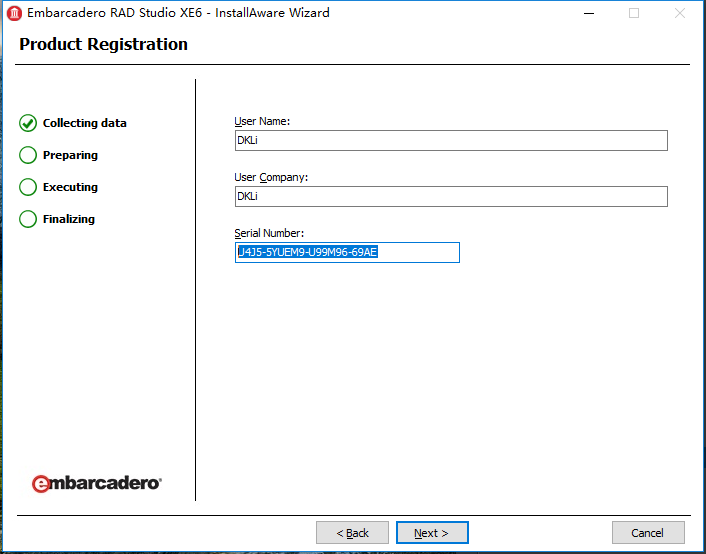

[](https://wenku.baidu.com/view/7079ca5053d380eb6294dd88d0d233d4b14e3f07.html)

总操作流程：
- 1、下载安装破解
- 2、配置环境
- 3、测试

***

# 下载安装破解

- 下载
[](http://altd.embarcadero.com/download/radstudio/10/delphicbuilder10.iso)

- 安装



```
U4J5-5YUEM9-U99M96-69AE

U4J5-9YTEM9-UX9M96-6YAE
```



- 破解
