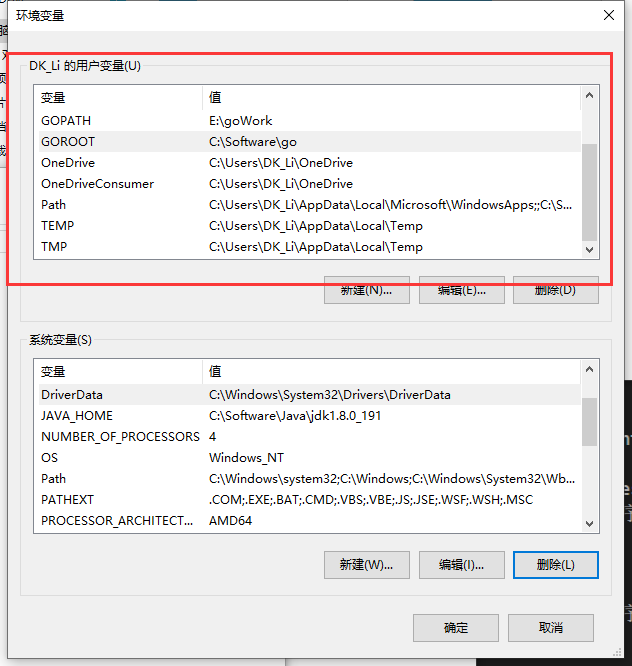

总操作流程：
- 1、[下载安装](#go-01)
- 2、[配置](#go-02)
- 3、[测试](#go-03)

***
# <a name="go-01" href="#" >下载安装</a>

[](https://golang.google.cn/dl/)

- 注意：应该下载压缩包，因为安装程序会指定工作目录

# <a name="go-02" href="#" >配置</a>

- 新建

```c
变量名：GOROOT
变量值: C:\Software\go

变量名：GOPATH
变量值：D:\goWork
```

- 添加到path

```c
;%GOROOT%;%GOPATH%;%GOROOT%\bin;%GOPATH%\bin
```

`全局设置`



# <a name="go-03" href="#" >测试</a>

- cmd下输入命令

```c
go env
```
