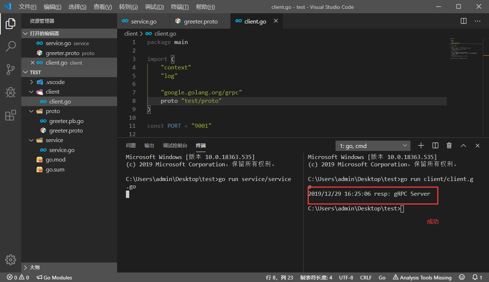

总操作流程：
- 1、[下载安装](#go-01)
- 2、[配置](#go-02)
- 3、[写代码](#go-03)
- 4、[测试](#go-04)

***

# <a name="go-01" href="#" >下载安装</a>

> protoc

[](https://github.com/protocolbuffers/protobuf/releases/tag/v3.8.0-rc1)

> 安装插件

`下载成功会在goWork的bin文件夹下`

```go
set GO111MODULE=on
set GOPROXY=https://goproxy.io

go install github.com/golang/protobuf/protoc-gen-go
```

- 将下载好的protoc-gen-go.exe自动到goWork\bin下
- 要是下载慢，到百度云下载

[](https://pan.baidu.com/s/1gLPs3OGrhIrSfXNvEe72pw)

# <a name="go-02" href="#" >配置</a>

> protoc

- 配置变量环境

```
变量名：  PROTOC_HOME
变量值：  C:\Software\protoc
Path:    ;%PROTOC_HOME%\bin
```

- cmd测试

```
protoc --version
```

# <a name="go-03" href="#" >写代码</a>

> 项目目录


> service.go

```go

package main

import (
	"context"
	"log"
	"net"

	"google.golang.org/grpc"
	proto "test/proto"
 
)
 
type SearchService struct{}

func (s *SearchService) Search(ctx context.Context, r *proto.SearchRequest) (*proto.SearchResponse, error) {
	return &proto.SearchResponse{Response: r.GetRequest() + " Server"}, nil
}

const PORT = "9001"

func main() {
	lis, err := net.Listen("tcp", ":"+PORT)
	if err != nil {
		log.Fatalf("net.Listen err: %v", err)
	}
    server := grpc.NewServer()
	proto.RegisterSearchServiceServer(server, &SearchService{})
	server.Serve(lis)
}
```

> client.go

```go
package main
 
import (
	"context"
	"log"

	"google.golang.org/grpc"
	proto "test/proto"
)
 
const PORT = "9001"

func main() {
	conn, err := grpc.Dial(":"+PORT, grpc.WithInsecure())
	if err != nil {
		log.Fatalf("grpc.Dial err: %v", err)
	}
	defer conn.Close()

	client := proto.NewSearchServiceClient(conn)
	resp, err := client.Search(context.Background(), &proto.SearchRequest{
		Request: "gRPC",
	})
	if err != nil {
		log.Fatalf("client.Search err: %v", err)
	}

	log.Printf("resp: %s", resp.GetResponse())
}
```

> greeter.proto

```js

syntax = "proto3";

package proto;

service SearchService {
    rpc Search(SearchRequest) returns (SearchResponse) {}
}

message SearchRequest {
    string request = 1;
}

message SearchResponse {
    string response = 1;
}
```

> 编译greeter.proto

```js
# 进入proto目录下，在shell输入命令

cd proto

protoc -I . greeter.proto --go_out=plugins=grpc:.
```


# <a name="go-04" href="#" >测试</a>

> 下载依赖

- 开启mod

`在test目录下进行命令输入`

```shell
cd ..
set GO111MODULE=on
set GOPROXY=https://goproxy.io

go mod init test
go mod tidy
```

- 复原的命令

```
set GO111MODULE=auto
set  GOPROXY=
```

> 启动服务端

```js
go run service/service.go
```

> 启动客户端

```js
go run client/client.go
```



