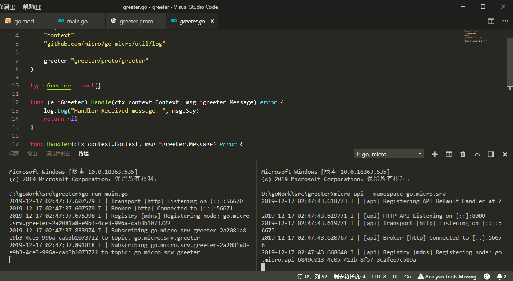
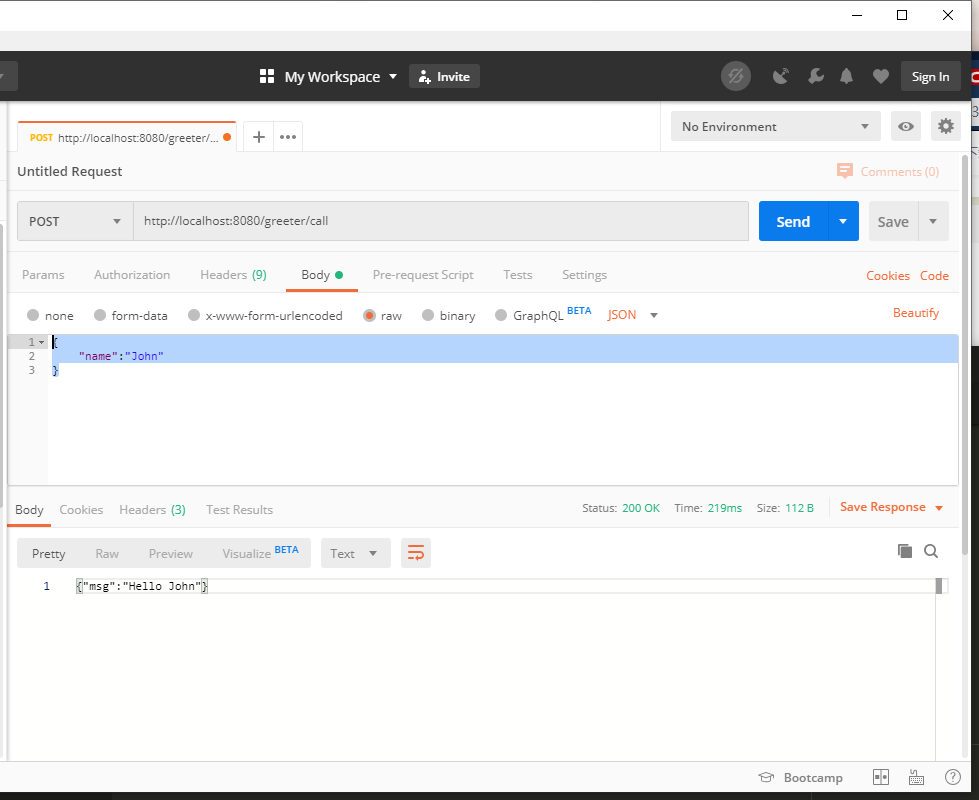

总操作流程：
- 1、下载安装
- 2、写代码
- 3、测试

***

# 下载安装

> 1、下载安装micro.exe

```shell
set GO111MODULE=on
set GOPROXY=https://goproxy.io

go install github.com/micro/micro
```

- 在GOPATH/bin/下生成micro.exe

[](https://pan.baidu.com/s/1badgXIlBj-TKt3F4JXNMgA)

> 2、下载greeter

```shell
micro new greeter
```

- 在GOPATH/src/下生成一个新的服务

# 写代码

> 1、proto生成go源码

```
cd proto/greeter

C:\Software\protoc\bin\protoc.exe --plugin=protoc-gen-go=C:\Software\go\bin\protoc-gen-go.exe --plugin=protoc-gen-micro=C:\Software\go\bin\protoc-gen-micro.exe --proto_path=./ --go_out=./ --micro_out=./ greeter.proto
```

> 2、下载依赖

- vs code控制台输入命令
```shell
cd ../..

set GO111MODULE=on
set GOPROXY=https://goproxy.io

go mod init greeter

```

`注意：go-micro的版本使用1.13.2，因为部分版本去掉了一些功能,所以修改go.mod指定版本`

```go
module greeter

go 1.13

require (
	github.com/golang/protobuf v1.3.2
	github.com/micro/go-micro v1.13.2
)

```

`指定版本后在更新需要的依赖`

```shell
# 每次更新依赖都要删除先前生成的go.sum
go mod tidy
```

# 测试

> 1、运行服务模板里的greeter服务和生成api服务

```shell
go run main.go
```

```
micro api --namespace=go.micro.srv
```



> 3、使用postman的post方式json格式请求

```shell
http://localhost:8080/greeter/call

{
	"name":"John"
}
```


