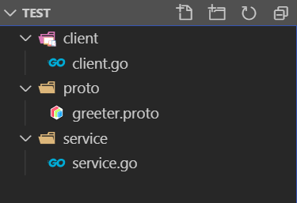

总操作流程：
- 1、[下载安装](#go-01)
- 2、[配置](#go-02)
- 3、[写代码](#go-03)
- 4、[测试](#go-04)

***

# <a name="go-01" href="#" >下载安装</a>

> protoc

[](https://github.com/protocolbuffers/protobuf/releases/tag/v3.8.0-rc1)

> 安装插件

`下载成功会在goWork的bin文件夹下`

```go
set GO111MODULE=on
set GOPROXY=https://goproxy.io

go install github.com/golang/protobuf/protoc-gen-go
```

- 将下载好的protoc-gen-go.exe自动到goWork\bin下
- 要是下载慢，到百度云下载

[](https://pan.baidu.com/s/1gLPs3OGrhIrSfXNvEe72pw)

# <a name="go-02" href="#" >配置</a>

> protoc

- 配置变量环境

```
变量名：  PROTOC_HOME
变量值：  C:\Software\protoc
Path:    ;%PROTOC_HOME%\bin
```

- cmd测试

```
protoc --version
```

# <a name="go-03" href="#" >写代码</a>

> 项目目录



> service.go

```go

package main

import (
	"log"
	"net"
	"golang.org/x/net/context"
	"google.golang.org/grpc"
	"google.golang.org/grpc/reflection"
	proto "test/proto"
 
)
 
const (
	port = ":50051"
)
 
// server is used to implement helloworld.GreeterServer.
type server struct{}
 
// SayHello implements helloworld.GreeterServer
func (s *server) SayHello(ctx context.Context, in *proto.HelloRequest) (*proto.HelloReply, error) {
	return &proto.HelloReply{Message: "Hello " + in.Name}, nil
}
 
func main() {
	lis, err := net.Listen("tcp", port)
	if err != nil {
		log.Fatalf("failed to listen: %v", err)
	}
	s := grpc.NewServer()
	proto.RegisterGreeterServer(s, &server{})
	// Register reflection service on gRPC server.
	reflection.Register(s)
	if err := s.Serve(lis); err != nil {
		log.Fatalf("failed to serve: %v", err)
	}
}
```

> client.go

```go
package main
 
 
import (
	"log"
	"os"
	"time"
 
	"golang.org/x/net/context"
	"google.golang.org/grpc"
	proto "test/proto"
)
 
const (
	address     = "192.168.200.8:50051"
	defaultName = "world"
)
 
func main() {
	// Set up a connection to the server.
	conn, err := grpc.Dial(address, grpc.WithInsecure())
	if err != nil {
		log.Fatalf("did not connect: %v", err)
	}
	defer conn.Close()
	c := proto.NewGreeterClient(conn)
 
	// Contact the server and print out its response.
	name := defaultName
	if len(os.Args) > 1 {
		name = os.Args[1]
	}
	ctx, cancel := context.WithTimeout(context.Background(), time.Second)
	defer cancel()
	r, err := c.SayHello(ctx, &proto.HelloRequest{Name: name})
	if err != nil {
		log.Fatalf("could not greet: %v", err)
	}
	log.Printf("Greeting: %s", r.Message)
}
```

> greeter.proto

```js

syntax = "proto3";
 
//package helloworld;
 
// The greeting service definition.
service Greeter {
    // Sends a greeting
    rpc SayHello (HelloRequest) returns (HelloReply) {}
}
 
// The request message containing the user's name.
message HelloRequest {
    string name = 1;
}
 
// The response message containing the greetings
message HelloReply {
    string message = 1;
}


```

> 编译greeter.proto

```js
# 进入proto目录下，在shell输入命令

cd proto

protoc -I . helloworld.proto --go_out=plugins=grpc:.
```


# <a name="go-04" href="#" >测试</a>

> 下载依赖

- 开启mod

`在test目录下进行命令输入`

```shell
cd ..
set GO111MODULE=on
set GOPROXY=https://goproxy.io

go mod init test
go mod tidy
```

- 复原的命令

```
set GO111MODULE=auto
set  GOPROXY=
```

> 启动服务端

```js
go run service/service.go
```

> 启动客户端

```js
go run client/client.go
```


