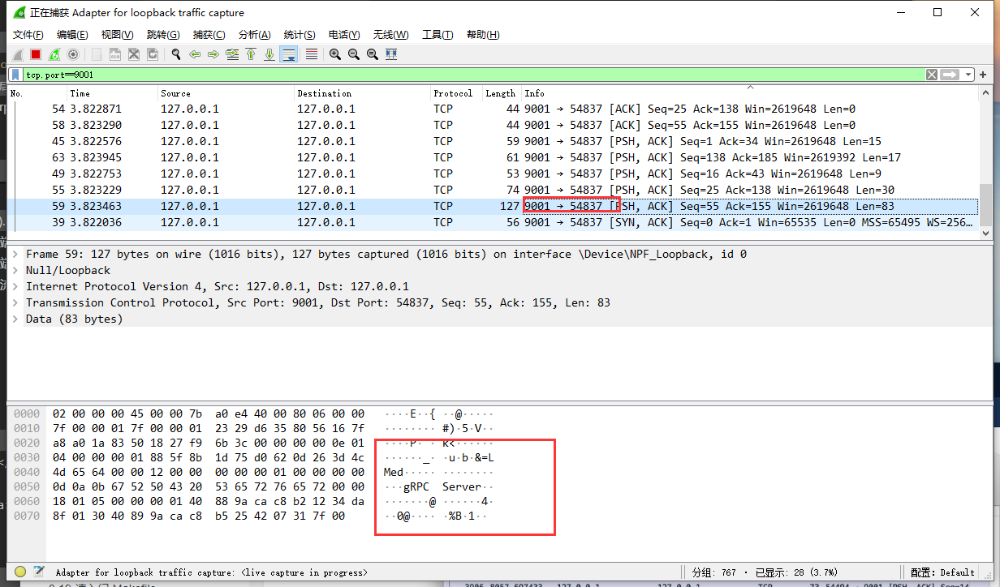

总操作流程：
- 1、下载安装
- 2、写代码
- 3、测试

***

# 下载安装

> http抓包工具

[](https://www.wireshark.org/#download)

> 测试

- 1、开启wireshark的抓包模式


```
tcp.port==9001
```


- 2、运行代码的service.go和client.go

[](https://github.com/OurNotes/CCN/blob/master/6.%E5%90%8E%E5%8F%B0/4.go/01.windows%E7%8E%AF%E5%A2%83/02.go%E4%B9%8B%E6%A1%86%E6%9E%B6/02.go%E4%B9%8Bgrpc/01.go-grpc%E4%B9%8BSimple%20RPC(%E7%AE%80%E5%8D%95rpc).md)

- 3、抓到包的效果



# 写代码


# 测试


