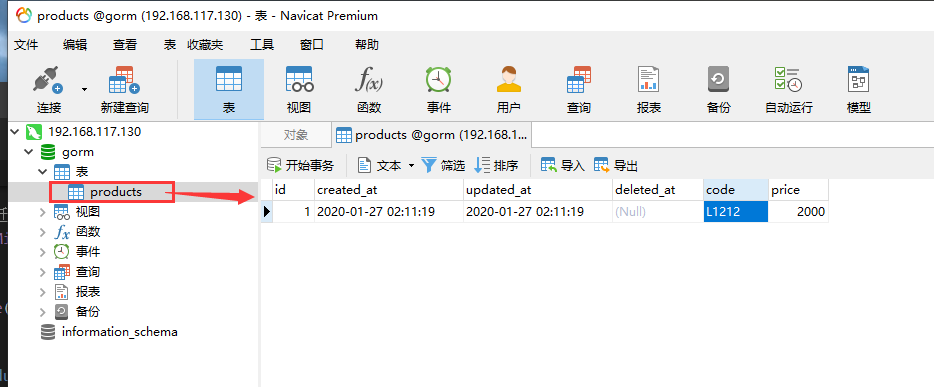

总操作流程：
- 1、安装
- 2、测试

***

# 安装

```shell
# 运行cmd，输入命令
set GO111MODULE=on
set GOPROXY=https://goproxy.io

go get -u github.com/jinzhu/gorm
go install github.com/jinzhu/gorm
```
# 测试

> 写代码

```go
package main

import (
    "github.com/jinzhu/gorm"
    _ "github.com/jinzhu/gorm/dialects/mysql"
)

type Product struct {
	gorm.Model
	Code string
	Price uint
}


func main() {
  // gorm.Open("mysql", "user:password@tcp(数据库ip:端口)/dbname?charset=utf8&parseTime=True&loc=Local")
  db, err := gorm.Open("mysql", "gorm:123456@tcp(192.168.117.130:3306)/gorm?charset=utf8&parseTime=True&loc=Local")
  if err != nil {
    panic("连接数据库失败")
  }
  defer db.Close()

  // 自动迁移模式
  db.AutoMigrate(&Product{})

 // 创建
 db.Create(&Product{Code: "L1212", Price: 1000})

   // 读取
  var product Product
  db.First(&product, 1) // 查询id为1的product
  db.First(&product, "code = ?", "L1212") // 查询code为l1212的product

  // 更新 - 更新product的price为2000
  db.Model(&product).Update("Price", 2000)

}
```

> 运行

```shell
set GO111MODULE=on
set GOPROXY=https://goproxy.io

go mod init test
go mod tidy

go run test.go
```

> 看效果

