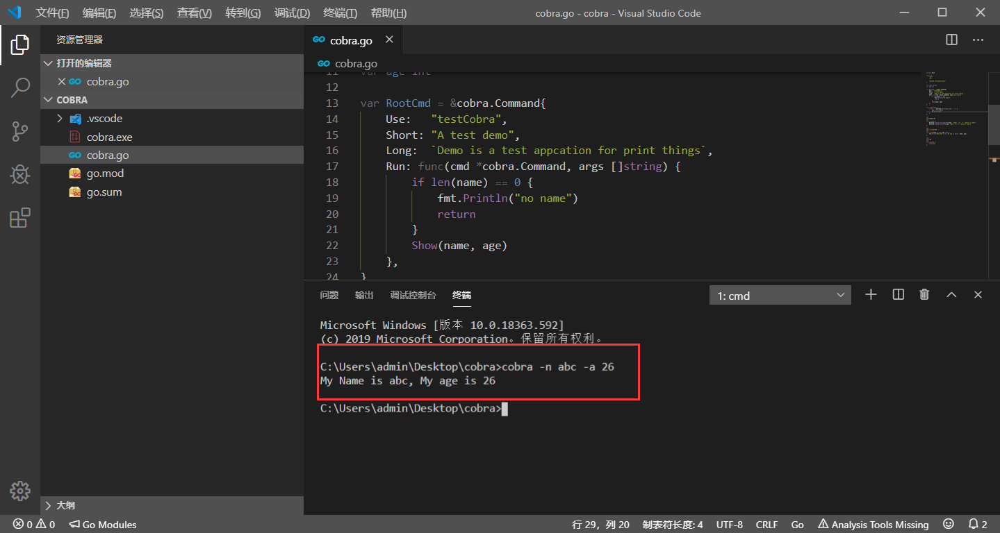
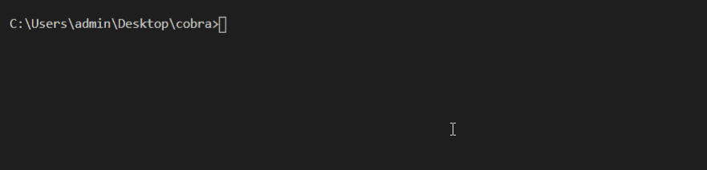

本页目录：
- 1、效果显示
- 2、写代码

***


# 效果显示

> 制作成cmd的命令

```
cobra -n abc -a 26
```



# 写代码

- 写代码

```go
package main
 
import (
	"fmt"
	"os"
 
	"github.com/spf13/cobra"
)

var name string
var age int
 
var RootCmd = &cobra.Command{
	Use:   "testCobra",
	Short: "A test demo",
	Long:  `Demo is a test appcation for print things`,
	Run: func(cmd *cobra.Command, args []string) {
		if len(name) == 0 {
			fmt.Println("no name")
			return
		}
		Show(name, age)
	},
}
 
func Execute() {
	if err := RootCmd.Execute(); err != nil {
		fmt.Println(err)
		os.Exit(-1)
	}
}

/**
*初始化的函数
**/
func init() {
	RootCmd.Flags().StringVarP(&name, "name", "n", "", "person's name")
	RootCmd.Flags().IntVarP(&age, "age", "a", 0, "person's age")
}

/**
*输出显示的函数
**/
func Show(name string, age int) {
	fmt.Printf("My Name is %s, My age is %d\n", name, age)
}

/**
*主函数
**/
func main() {
	Execute()
}

```

- 运行结果

```
set GO111MODULE=on
set GOPROXY=https://goproxy.io

go mod init cobra
go mod tidy


go run cobra.go -n ccc -a 28
```



- 编译

```
go build cobra.go
```
