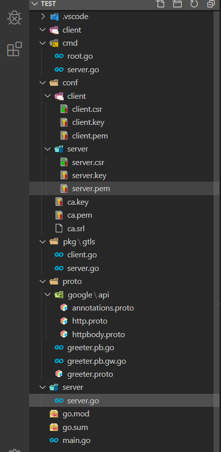
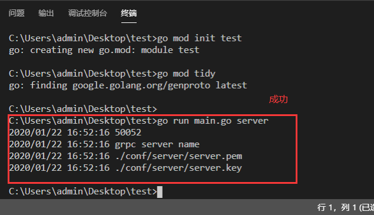
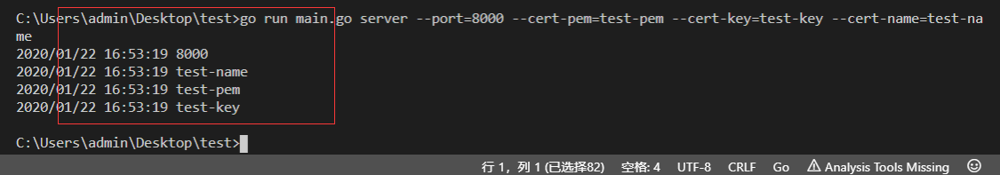

总操作流程
- 1、[编写cmd模块](#go-01)
- 2、[编辑server模块](#go-02)
- 3、[编辑client模块](#go-03)
- 4、[测试](#go-05)

> 本教程基于：go-grpc之Unary and Stream interceptor(拦截器)

***

- 项目目录




# <a name="go-01" href="#" >编写cmd模块</a>

> 1、下载google的api

[](https://github.com/grpc-ecosystem/grpc-gateway)

- 将third_party/googleapis/google/api下载，放到test项目的proto/google文件夹下

> 2、编写proto文件

- 在test项目的proto文件夹下新增greeter.proto文件

```go
syntax = "proto3";

package proto;

import "google/api/annotations.proto";

service HelloWorld {
    rpc SayHelloWorld(HelloWorldRequest) returns (HelloWorldResponse) {
        option (google.api.http) = {
            post: "/hello_world"
            body: "*"
        };
    }
}

message HelloWorldRequest {
    string referer = 1;
}

message HelloWorldResponse {
    string message = 1;
}
```

- 编译

```shell
# 进入proto目录下，在shell输入命令

cd proto

protoc -I .  --go_out=plugins=grpc:. greeter.proto

protoc --grpc-gateway_out=logtostderr=true:. greeter.proto
```

> 3、编写cmd模块

- 在service模块下 新建server.go文件

```go
package server

import (
    "log"
)

var (
    ServerPort string
    CertName string
    CertPemPath string
    CertKeyPath string
)

func Serve() (err error){
    log.Println(ServerPort)

    log.Println(CertName)

    log.Println(CertPemPath)

    log.Println(CertKeyPath)

    return nil
}
```

- 在cmd模块下 新建root.go文件

```go
package cmd

import (
    "fmt"
    "os"

    "github.com/spf13/cobra"
)

var rootCmd = &cobra.Command{
    Use:   "grpc",
    Short: "Run the gRPC hello-world server",
}

func Execute() {
    if err := rootCmd.Execute(); err != nil {
        fmt.Println(err)
        os.Exit(-1)
    }
}
```

- 在cmd模块下 server.go文件

```go
package cmd

import (
    "log"

    "github.com/spf13/cobra"

    "test/service"
)

var serverCmd = &cobra.Command{
    Use:   "server",
    Short: "Run the gRPC hello-world server",
    Run: func(cmd *cobra.Command, args []string) {
        defer func() {
            if err := recover(); err != nil {
                log.Println("Recover error : %v", err)
            }
        }()

        server.Serve()
    },
}

func init() {
    serverCmd.Flags().StringVarP(&server.ServerPort, "port", "p", "50052", "server port")
    serverCmd.Flags().StringVarP(&server.CertPemPath, "cert-pem", "", "./conf/server/server.pem", "cert pem path")
    serverCmd.Flags().StringVarP(&server.CertKeyPath, "cert-key", "", "./conf/server/server.key", "cert key path")
    serverCmd.Flags().StringVarP(&server.CertName, "cert-name", "", "grpc server name", "server's hostname")
    rootCmd.AddCommand(serverCmd)
}

```

- 在根目录下 新建main.go

```go
package main

import (
    "test/cmd"
)

func main() {
    cmd.Execute()
}
```

> 4、测试

```shell
# cmd 进到test根目录

set GO111MODULE=on
set GOPROXY=https://goproxy.io

go mod init test
go mod tidy

go run main.go server
```




```shell
go run main.go server --port=8000 --cert-pem=test-pem --cert-key=test-key --cert-name=test-name
```



# <a name="go-02" href="#" >编辑server模块</a>