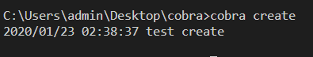
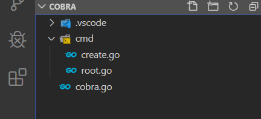
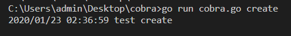

本页目录：
- 1、[看效果](#go-01)
- 2、[写代码](#go-02)

***

# <a name="go-01" href="#" >看效果</a>

```
cobra create
```



# <a name="go-02" href="#" >写代码</a>

> 项目目录



> 写代码

- 1、cobra.go

```go
package main

import "cobra/cmd"

func main() {
  cmd.Execute()
}
```

- 2、root.go

```go
package cmd
 
import (
	"fmt"
	"os"
	"github.com/spf13/cobra"
)

var rootCmd = &cobra.Command{
	Use:   "root",
	Short: "A test root",
	Long:  `Demo is a test appcation for print things`,
  }
  
  
/**
*作用：将所有子命令添加到根命令集标志
**/
 func Execute() {
	if err := rootCmd.Execute(); err != nil {
	  fmt.Println(err)
	  os.Exit(1)
	}
  }
```

- create.go

```go

package cmd

import (
    "log"

    "github.com/spf13/cobra"
)

var createCmd = &cobra.Command{
    Use:   "create",
	Short: "A test create",
	Long:  `Demo is a test appcation for print things`,

    Run: func(cmd *cobra.Command, args []string) {
        defer func() {
            if err := recover(); err != nil {
                log.Println("Recover error : %v", err)
            }
        }()

         log.Println("test create")
    },
}
 
func init() {
	rootCmd.AddCommand(createCmd)        
}

```

> 运行
```
set GO111MODULE=on
set GOPROXY=https://goproxy.io

go mod init cobra
go mod tidy


go run cobra.go create
```



> 编译

```
go build cobra.go
```