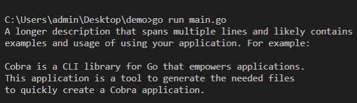

总操作流程：
- 1、[初始化](#go-01)
- 2、[测试](#go-02)

***

# <a name="go-01" href="#" >初始化</a>

```shell
# 运行git Bash Here
cobra init demo --pkg-name=demo
```

# <a name="go-02" href="#" >测试</a>

```shell
# vs code打开项目，在控制台输入命令
set GO111MODULE=on
set GOPROXY=https://goproxy.io

go mod init demo
go mod tidy

go run main.go
```

- 成功标志



