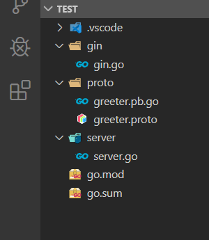

总操作流程：
- 1、单独测试成功
- 2、集成
- 3、测试


> 说明gin相当mvc中的Controller层；gprc相当service层

***

# 单独测试成功

> 单独测试gin

[](https://github.com/OurNotes/CCN/blob/master/6.%E5%90%8E%E5%8F%B0/4.go/01.windows%E7%8E%AF%E5%A2%83/02.go%E4%B9%8B%E6%A1%86%E6%9E%B6/01.go%E4%B9%8Bgin/01.gin%E4%B9%8B%E5%BF%AB%E9%80%9F%E5%BC%80%E5%A7%8B.md)

> 单独测试成功grpc

[-yellow.svg "参考文献 go-grpc之SimpleRPC(简单rpc)")](https://github.com/OurNotes/CCN/blob/master/6.%E5%90%8E%E5%8F%B0/4.go/01.windows%E7%8E%AF%E5%A2%83/02.go%E4%B9%8B%E6%A1%86%E6%9E%B6/02.go%E4%B9%8Bgrpc/01.go-grpc%E4%B9%8BSimple%20RPC(%E7%AE%80%E5%8D%95rpc).md)

# 集成

> 项目目录



> proto

```go
syntax = "proto3";

package proto;

service SearchService {
    rpc Search(SearchRequest) returns (SearchResponse) {}
}

message SearchRequest {
    string request = 1;
}

message SearchResponse {
    string response = 1;
}
```

- 编译

```js
# 进入proto目录下，在shell输入命令

cd proto

protoc -I . greeter.proto --go_out=plugins=grpc:.
```

> gin

```go
package main

import (
	"log"
	"context"

	"github.com/gin-gonic/gin"
	proto "test/proto"
	"google.golang.org/grpc"
)

const PORT = "8080"

func main() {

		//创建与给定目标（服务端）的连接交互
		conn, err := grpc.Dial(":"+PORT, grpc.WithInsecure())
		if err != nil {
			log.Fatalf("grpc.Dial err: %v", err)
		}
		defer conn.Close()
	
		//创建 SearchService 的客户端对象
		client := proto.NewSearchServiceClient(conn)


	r := gin.Default() 
	r.GET("/ping", func(c *gin.Context) {
		resp, err := client.Search(context.Background(), &proto.SearchRequest{
			Request: "gRPC",
		})
		if err != nil {
			log.Fatalf("client.Search err: %v", err)
		}

		c.JSON(200, gin.H{
			"result": resp.GetResponse(),
		})
	})
	// 启动并监听8089端口
	if err := r.Run(":8089"); err != nil {
		log.Fatalf("could not run server: %v", err)
	}

}
```

> grpc

```go
package main
 
import (
	"context"
	"log"
	"net"

	"google.golang.org/grpc"
	proto "test/proto"
	"google.golang.org/grpc/reflection"
 
)

type SearchService struct{}

func (s *SearchService) Search(ctx context.Context, r *proto.SearchRequest) (*proto.SearchResponse, error) {
	return &proto.SearchResponse{Response: r.GetRequest() + " Server"}, nil
}

const PORT = "8080"

func main() {
	//创建 Listen，监听 TCP 端口
	lis, err := net.Listen("tcp", ":"+PORT)
	if err != nil {
		log.Fatalf("net.Listen err: %v", err)
	}
	//创建 gRPC Server 对象
	server := grpc.NewServer()
	//将 SearchService注册到 gRPC Server 的内部注册中心
	proto.RegisterSearchServiceServer(server, &SearchService{})
	
	// Register reflection service on gRPC server.
	reflection.Register(server)
	if err := server.Serve(lis); err != nil {
		log.Fatalf("failed to serve: %v", err)
	}
}
```

# 测试

> 先运行grpc

```
go run server/server.go
```

> 再运行gin

```
go run gin/gin.go
```


> 最后使用postman测试接口

```
http://localhost:8089/ping
```


