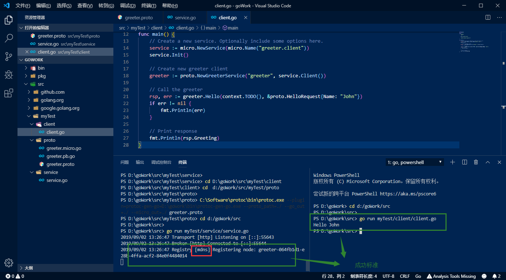

总操作流程：
- 1、[修改程序](#go-01)
- 2、[测试](#go-02)

***

# <a name="go-01" href="#" >修改程序</a>
> service.go

```go
package main

import (
	"context"
	"fmt"

	proto "test/proto"

	"github.com/micro/go-micro"
)

type Greeter struct{

}

func (g *Greeter) Hello(ctx context.Context, 
						req *proto.HelloRequest, 
						rsp *proto.HelloResponse) error {
	rsp.Greeting = "Hello " + req.Name
	return nil
}

func main() {
	// 创建一个微服务
	service := micro.NewService(
		micro.Name("greeter"),//微服务的名字
        micro.RegisterTTL(3000),//微服务的过期时间
        micro.RegisterInterval(3000),//间隔多久再次注册微服务
	)

	// 初始化微服务
	service.Init()

	//  注册服务信息到Registry
	proto.RegisterGreeterHandler(service.Server(), new(Greeter))

	// Run the server
	if err := service.Run(); err != nil {
		fmt.Println(err)
	}
}

```

> client.go

```go
package main

import (
	"context"
	"fmt"

	proto "test/proto"

	"github.com/micro/go-micro"
)

func main() {
	// 创建一个微服务
	service := micro.NewService(
		micro.Name("greeter.client"),
	)
	// 初始注册服务
	service.Init()

	// 客户端监听Registry，服务选择和服务发现
	greeter := proto.NewGreeterService("greeter", service.Client())

	// 调用greeter微服务的服务端的函数
	rsp, err := greeter.Hello(context.TODO(), &proto.HelloRequest{Name: "John"})
	if err != nil {
		fmt.Println(err)
	}

	// 获取调用函数的返回信息
	fmt.Println(rsp.Greeting)
}
```

# <a name="go-02" href="#" >测试</a>

> 下载依赖

- 开启mod

`在test目录下进行命令输入`

```shell
set GO111MODULE=on
set GOPROXY=https://goproxy.io

go mod init test
```

`注意：go-micro的版本使用1.13.2，因为部分版本去掉了一些功能,所以修改go.mod指定版本`

```go
module test

go 1.13

require (
	github.com/golang/protobuf v1.3.2
	github.com/micro/go-micro v1.13.2
)

```

`指定版本后在更新需要的依赖`


```shell
# 每次更新依赖都要删除先前生成的go.sum
go mod tidy
```

- 复原的命令

```
set GO111MODULE=auto
set  GOPROXY=
```

> 启动服务端

```js
go run service/service.go
```

> 启动客户端

```js
go run client/client.go
```


