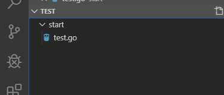
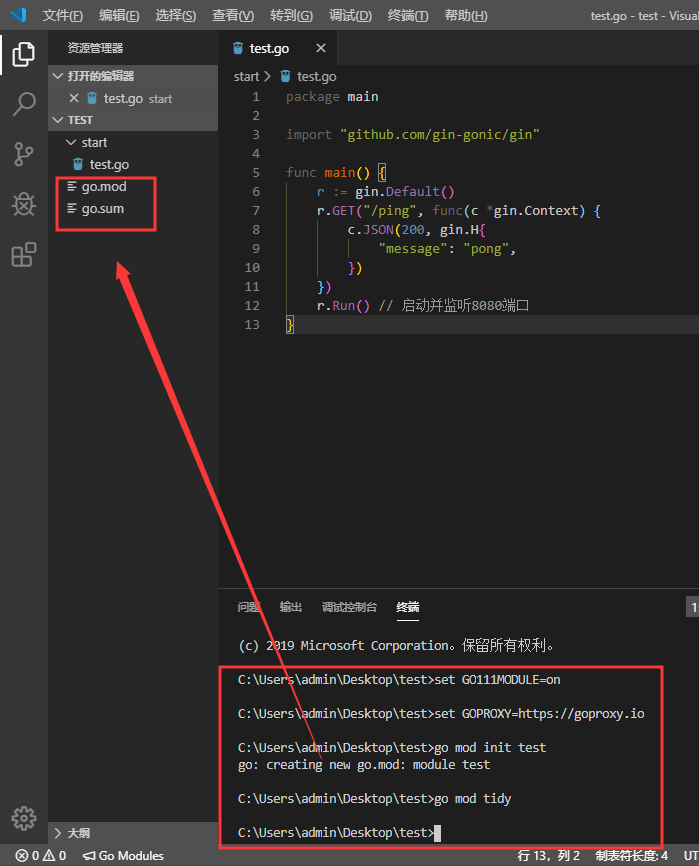
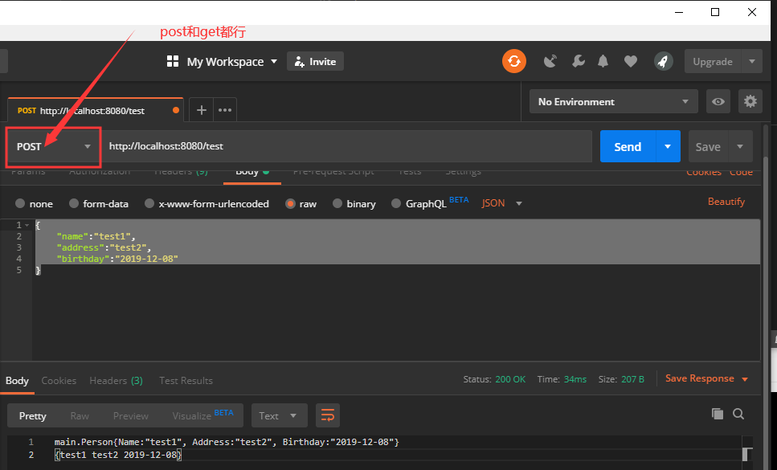

总操作流程：
- 1、[写代码](#go-01)
- 2、[编译](#go-02)
- 3、[看效果](#go-03)

***

# <a name="go-01" href="#" >写代码</a>

- 项目目录



> 写代码

- test.go

```go
package main

import (
	"github.com/gin-gonic/gin"
	//"log"
	"net/http"
)

/*
参数的结构体
*/
type Person struct{
	Name string `form:"name"`
	Address string `form:"address"`
	Birthday string `form:"birthday"`
}

func main() {
	r := gin.Default() 
	r.POST("/test", testing)
	r.GET("/test", testing)
	r.Run() // 启动并监听8080端口
}

func testing(c *gin.Context){
	var person Person
	if err:=c.ShouldBind(&person); err==nil{
		//log.Println(person.Name)
		c.String(http.StatusOK,"%#v\n",person)
		c.String(http.StatusOK,"%v",person)
	}else{
		c.String(http.StatusOK,"%v","person bind error:%v",err)
	}
}
```

# <a name="go-02" href="#" >编译</a>

> 按快捷键：<kbd>Ctrl</kbd>+<kbd>`</kbd>,vs code进入终端输入命令。

```shell
set GO111MODULE=on
set GOPROXY=https://goproxy.io

go mod init test
go mod tidy

```



> 运行

```shell
go run start/test.go
```

# <a name="go-03" href="#" >看效果</a>

> 使用postman进行post方式接口测试

```shell
http://localhost:8080/test


{
	"name":"test1",
	"address":"test2",
	"birthday":"2019-12-08"
}
```

