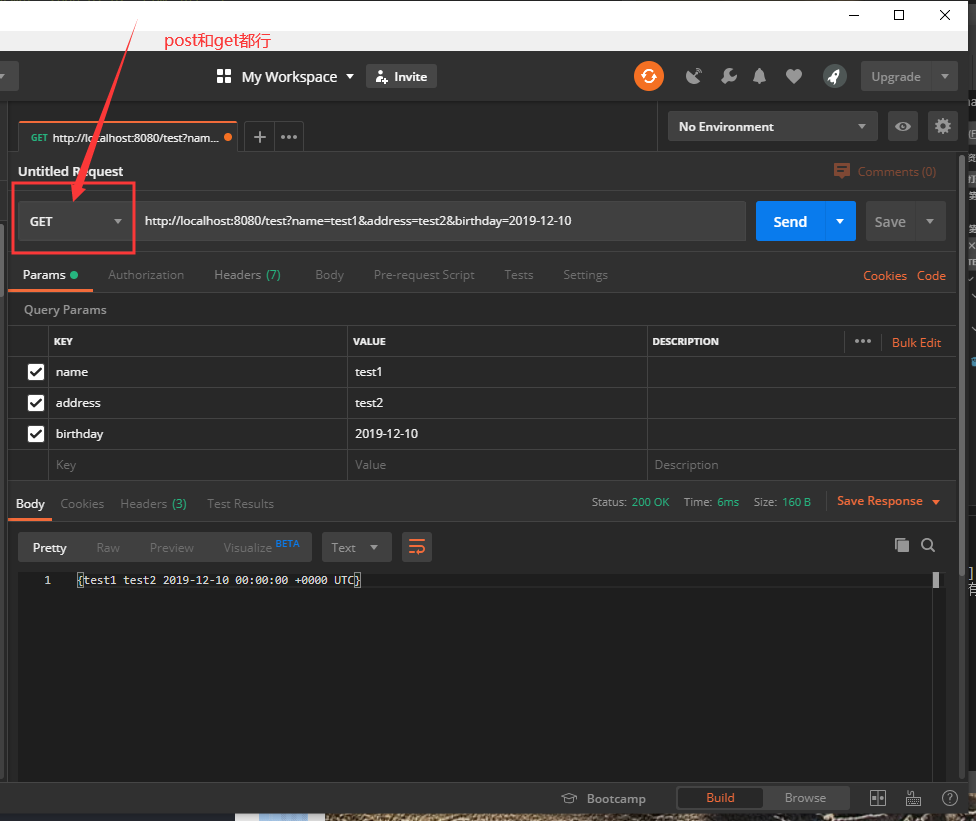

总操作流程：
- 1、[写代码](#go-01)
- 2、[编译](#go-02)
- 3、[看效果](#go-03)

***

# <a name="go-01" href="#" >写代码</a>

- 项目目录


> 写代码

- test.go

```go
package main

import (
	"net/http"
	"time"

	"github.com/gin-gonic/gin"
)

type Person struct {
	Name     string    `form:"name" binding:"required"`
	Address  string    `form:"address"`
	Birthday time.Time `form:"birthday" time_format:"2006-01-02" time_utc:"1"`
}

func main() {
	route := gin.Default()
	route.GET("/test", startPage)
	route.POST("/test", startPage)
	route.Run()
}

func startPage(c *gin.Context) {
	var person Person
	err:=c.ShouldBind(&person)
	if err==nil{
		c.String(http.StatusOK,"%v",person)
	}else{
		c.String(http.StatusOK,"%v","person bind error:%v",err)
	}
}
```

# <a name="go-02" href="#" >编译</a>

> 按快捷键：<kbd>Ctrl</kbd>+<kbd>`</kbd>,vs code进入终端输入命令。

```shell
set GO111MODULE=on
set GOPROXY=https://goproxy.io

go mod init test
go mod tidy

```


> 运行

```shell
go run start/test.go
```

# <a name="go-03" href="#" >看效果</a>

> 使用postman进行post/get方式接口测试正确的

```shell
http://localhost:8080/test?name=test1&address=test2&birthday=2019-12-10
```



> 使用postman进行post/get方式接口测试错误的

```shell
http://localhost:8080/test?address=test2&birthday=2019-12-10
```