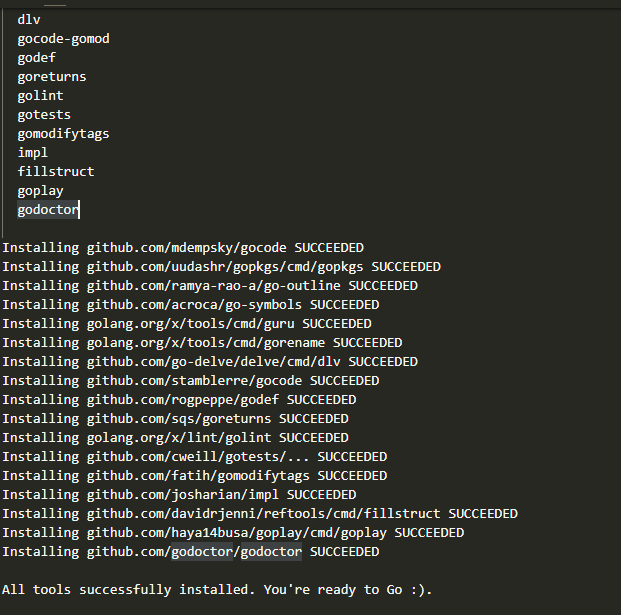

总操作流程：
- 1、下载安装
- 2、配置
- 3、测试

***

# 下载安装

> 1、vscode下载安装go插件

> 2、下载安装go组件

- 1、创建文件夹

goWork
goWork\bin
goWork\src
goWork\pkg
goWork\src\golang.org\x

- 2、下载组件

加入goWork\src\golang.org\x文件夹下，使用git下载组件

```c
git clone https://github.com/golang/lint.git
git clone https://github.com/golang/tools.git
git clone https://github.com/golang/sys.git
git clone https://github.com/golang/text.git
git clone https://github.com/golang/net.git
git clone https://github.com/golang/tour.git

```

- 3、安装组件

按快捷键：Ctrl+Shift+p

输入：Go: Install/Update Tools ，选择所有

成功标志：



