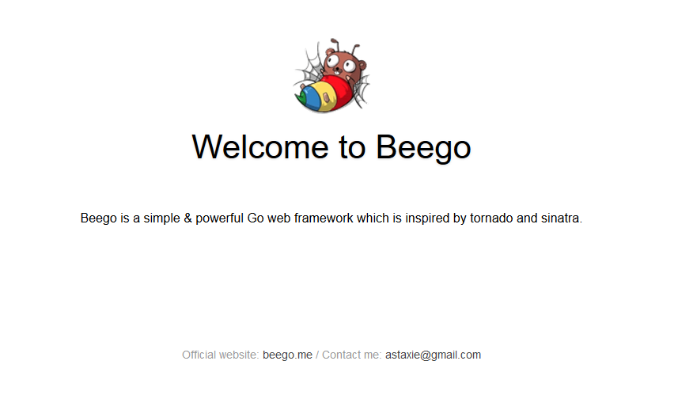
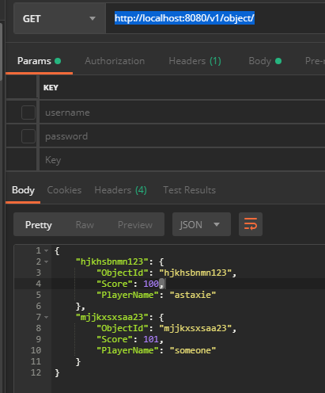

[](https://beego.me/docs/quickstart/)


总操作流程：
- 1、[配置](#beego-01)
- 2、[下载安装](#beego-02)
- 3、[测试](#beego-03)

***

# <a name="beego-01" href="#" >配置</a>

>添加环境变量

```shell
;%GOPATH%\bin
```

# <a name="beego-02" href="#" >下载安装</a>

> 1、下载bee

```go
go get github.com/beego/bee
```
- 下慢，可以在/windows/system32/drivers/etc下的host文件后添加
```js
	192.30.253.112 github.com
	151.101.185.194 github.global.ssl.fastly.net
```

- 可以通过百度云下载好的bee.exe文件放到%GOPATH%\bin下

[](https://pan.baidu.com/s/1vrFRLnXOU1U3H7f77x1dXw)

> 2、下载安装ansicolor

- 在goWork\src\github.com文件夹下创建shiena，使用git下载

```git
git clone https://github.com/shiena/ansicolor.git
```
- 使用cmd进行安装
```shell
go install github.com/shiena/ansicolor
```

- 可以通过百度云下载好的，解压放到shiena文件夹下

[](https://pan.baidu.com/s/13uI4t4BK_gtefNyoDLCn-g)

> 3、下载安装beego

- 在goWork\src\github.com文件夹下创建astaxie，使用git下载

```git
git clone https://github.com/astaxie/beego.git
```
- 使用cmd进行安装
```shell
go install  github.com/astaxie/beego
```

- 可以通过百度云下载好的，解压放到beego文件夹下

[](https://pan.baidu.com/s/1XIGp0UJe8r1kMvJzjM2SGg)


# <a name="beego-03" href="#" >测试</a>

> 1、创建Web项目

- 进入$GOPATH/src文件夹下
- 使用命令创建web项目：bee new <项目名>
- 进入$GOPATH/src/<项目名>使用命令启动项目：bee run
- 浏览器输入地址看效果：http://localhost:8080



> 2、创建API应用

- 进入$GOPATH/src文件夹下
- 使用命令创建API应用：bee api <项目名>
- 进入$GOPATH/src/<项目名>使用命令启动项目： bee run -gendoc=true -downdoc=true
- postman输入get请求方式的链接看效果：http://localhost:8080/v1/object/
- 可以浏览器输入地址看接口信息：http://localhost:8080/swagger/



