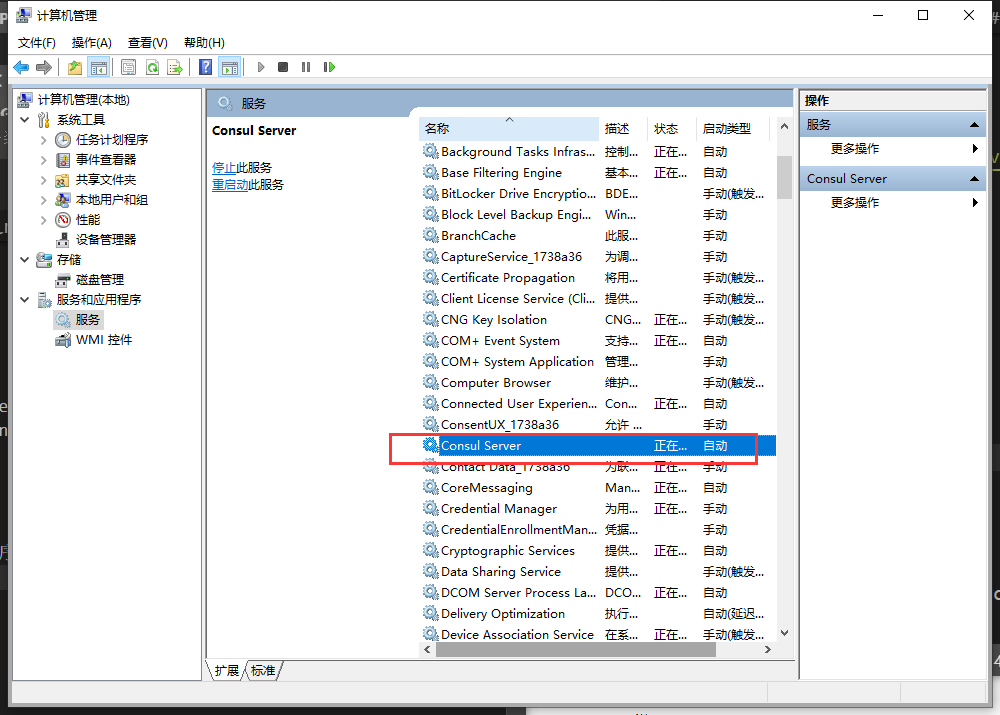
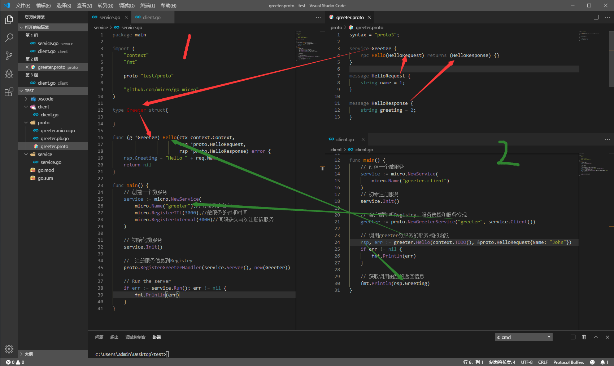
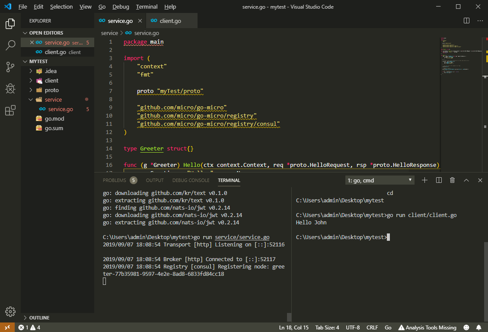

总操作流程：
- 1、下载安装
- 2、配置
- 3、写代码
- 4、测试

***

# 下载安装

> Consul

[](https://www.consul.io/downloads.html)

> protoc

[](https://github.com/protocolbuffers/protobuf/releases/tag/v3.8.0-rc1)

> 安装插件

`下载成功会在goWork的bin文件夹下`

```go
go get -v github.com/golang/protobuf/protoc-gen-go
go get -v github.com/micro/protoc-gen-micro
```

- 将下载好的protoc-gen-go.exe和protoc-gen-micro.exe迁移到go\bin下
- 要是下载慢，到百度云下载

[](https://pan.baidu.com/s/1gLPs3OGrhIrSfXNvEe72pw)

[](https://pan.baidu.com/s/1VPudVA-ChTh578SGaCnXmw)


# 配置

> Consul

- 配置变量环境

```
变量名： CONSUL_HOME
变量值： C:\Software\consul
Path:  ;%CONSUL_HOME%

consul version
```

- 添加window注册服务

```
sc.exe create "Consul Server" binPath="C:\Software\consul\consul.exe agent -dev"
```

- 启动

计算机管理 > 服务和应用程序 > 服务 > 找到“Consul Server” ，然后右击运行，同时也设定自动启动



- 测试

```
# cmd输入命令
consul version
```
浏览器输入地址：http://localhost:8500

> protoc

- 配置变量环境

```
变量名：  PROTOC_HOME
变量值：  C:\Software\protoc
Path:    ;%PROTOC_HOME%\bin
```

- cmd测试

```
protoc --version
```

# 写代码

> 项目目录



> service.go

```go
package main

import (
	"context"
	"fmt"

	proto "test/proto"

	"github.com/micro/go-micro"
	"github.com/micro/go-micro/registry"
	"github.com/micro/go-micro/registry/consul"
)

type Greeter struct{

}

func (g *Greeter) Hello(ctx context.Context, 
						req *proto.HelloRequest, 
						rsp *proto.HelloResponse) error {
	rsp.Greeting = "Hello " + req.Name
	return nil
}

func main() {
	// 创建一个微服务
	service := micro.NewService(
		micro.Name("greeter"),//微服务的名字
        micro.RegisterTTL(3000),//微服务的过期时间
        micro.RegisterInterval(3000)//间隔多久再次注册微服务
	)

	// 初始化微服务
	service.Init()

	//  注册服务信息到Registry
	proto.RegisterGreeterHandler(service.Server(), new(Greeter))

	// Run the server
	if err := service.Run(); err != nil {
		fmt.Println(err)
	}
}
```

> client.go

```go
package main

import (
	"context"
	"fmt"

	proto "test/proto"

	"github.com/micro/go-micro"
	"github.com/micro/go-micro/registry"
	"github.com/micro/go-micro/registry/consul"
)

func main() {
	// 创建一个微服务
	service := micro.NewService(
		micro.Name("greeter.client")
	)
	// 初始注册服务
	service.Init()

	// 客户端监听Registry，服务选择和服务发现
	greeter := proto.NewGreeterService("greeter", service.Client())

	// 调用greeter微服务的服务端的函数
	rsp, err := greeter.Hello(context.TODO(), &proto.HelloRequest{Name: "John"})
	if err != nil {
		fmt.Println(err)
	}

	// 获取调用函数的返回信息
	fmt.Println(rsp.Greeting)
}
```

> greeter.proto

```js
syntax = "proto3";

service Greeter {
	rpc Hello(HelloRequest) returns (HelloResponse) {}
}

message HelloRequest {
	string name = 1;
}

message HelloResponse {
	string greeting = 2;
}

```

> 编译greeter.proto

```js
# 进入protoc目录下，在shell输入命令
cd protoc

C:\Software\protoc\bin\protoc.exe --plugin=protoc-gen-go=C:\Software\go\bin\protoc-gen-go.exe --plugin=protoc-gen-micro=C:\Software\go\bin\protoc-gen-micro.exe --proto_path=./ --go_out=./ --micro_out=./ greeter.proto
```

- 代码直接的关联


# 测试 

> 下载依赖

- 开启mod

```shell
cd ..

set GO111MODULE=on
set  GOPROXY=https://goproxy.io
```

- 复原的命令

```
set GO111MODULE=auto
set  GOPROXY=
```
- 在test目录下进行命令输入
```go
go mod init test

go mod tidy
```

> 启动服务端

```js
cd /test/service

go run service.go
```

- 进入http://localhost:8500 服务器


> 启动客户端

```js
cd ..
cd /test/client

go run client.go
```



