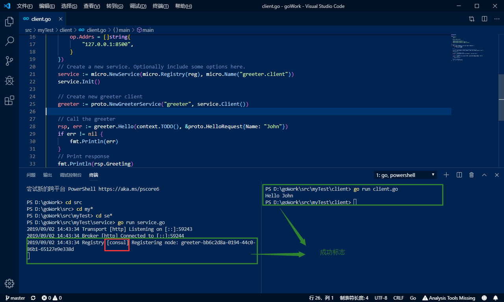

总操作流程：
- 1、[Consul的安装配置](#go-01)
- 2、[改程序](#go-02)
- 3、[看效果](#go-03)

***

> 该教程基于“1.mirco之配置环境(默认mdns方式作为微服务发现)”

# <a name="go-01" href="#" >Consul的安装配置</a>

- 下载

[](https://www.consul.io/downloads.html)

- 配置变量环境

```
变量名： CONSUL_HOME
变量值： C:\Software\consul
Path:  ;%CONSUL_HOME%

consul version
```

- 添加window注册服务

```
sc.exe create "Consul Server" binPath="C:\Software\consul\consul.exe agent -dev"
```

- 启动

```
consul agent -dev
```

# <a name="go-02" href="#" >改程序</a>

- 1、service.go

```go
package main

import (
	"context"
	"fmt"

	proto "myTest/proto"

	"github.com/micro/go-micro"
	"github.com/micro/go-micro/registry"
	"github.com/micro/go-micro/registry/consul"
)

type Greeter struct{}

func (g *Greeter) Hello(ctx context.Context, req *proto.HelloRequest, rsp *proto.HelloResponse) error {
	rsp.Greeting = "Hello " + req.Name
	return nil
}

func main() {
	reg := consul.NewRegistry(func(op *registry.Options) {
		op.Addrs = []string{
			"127.0.0.1:8500",
		}
	})
	// Create a new service. Optionally include some options here.
	service := micro.NewService(
		micro.Registry(reg),
		micro.Name("greeter"),
	)

	// Init will parse the command line flags.
	service.Init()

	// Register handler
	proto.RegisterGreeterHandler(service.Server(), new(Greeter))

	// Run the server
	if err := service.Run(); err != nil {
		fmt.Println(err)
	}
}

```

- 2、client.go

```go
package main

import (
	"context"
	"fmt"

	proto "myTest/proto"

	"github.com/micro/go-micro"
	"github.com/micro/go-micro/registry"
	"github.com/micro/go-micro/registry/consul"
)

func main() {
	reg := consul.NewRegistry(func(op *registry.Options) {
		op.Addrs = []string{
			"127.0.0.1:8500",
		}
	})
	// Create a new service. Optionally include some options here.
	service := micro.NewService(micro.Registry(reg), micro.Name("greeter.client"))
	service.Init()

	// Create new greeter client
	greeter := proto.NewGreeterService("greeter", service.Client())

	// Call the greeter
	rsp, err := greeter.Hello(context.TODO(), &proto.HelloRequest{Name: "John"})
	if err != nil {
		fmt.Println(err)
	}

	// Print response
	fmt.Println(rsp.Greeting)
}
```

# <a name="go-03" href="#" >看效果</a>

- 1、运行



- 2、进入http://localhost:8500 服务器

