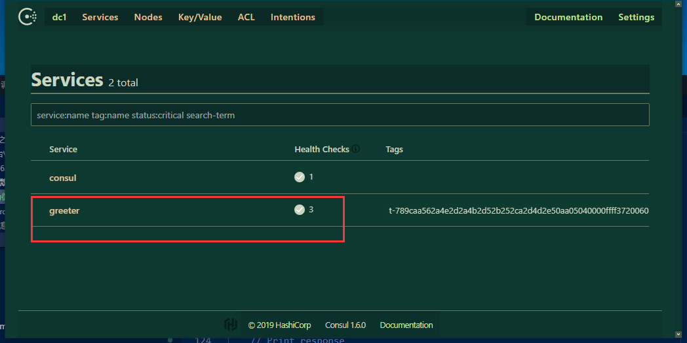
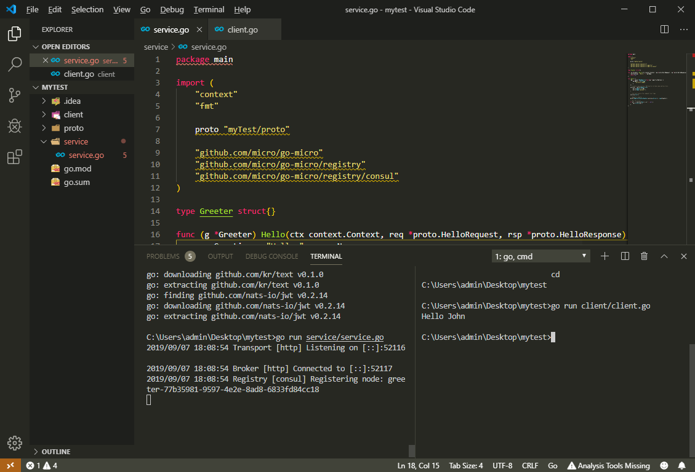

总操作流程：
- 1、[设置配置](#go-01)
- 2、[下载依赖](#go-02)
- 3、[测试](#go-03)

***

> 注意：该教程基于 2.mirco之配置环境(使用consul方式作为微服务发现)

# <a name="go-01" href="#" >设置配置</a>

- vs code的shell要配置：[](https://github.com/OurNotes/CCN/blob/master/1.%E5%B7%A5%E5%85%B7/10.vs%20code/19-vs%20code%E4%B9%8B%E4%BF%AE%E6%94%B9%E9%BB%98%E8%AE%A4%E7%BB%88%E7%AB%AF.md)

> 1、打开vs code的控制台,输入命令

```shell
set GO111MODULE=on
set GOPROXY=https://goproxy.io
```

> 2、下载依赖

- 1、清空go的工作区的所有文件
- 2、将mirco之配置环境(使用consul方式作为微服务发现)中的myTest的文件夹迁移到任何位置
- 3、vs code进入打开myTest的文件夹，在控制台输入命令

`开启mod`

```shell
set GO111MODULE=on
set  GOPROXY=https://goproxy.io
```

# <a name="go-02" href="#" >下载依赖</a>

> 在mytest目录下进行命令输入

```go
go mod init myTest

go mod tidy
```

# <a name="go-03" href="#" >测试</a>

> 1、启动服务端

```go
go run service/service.go
```

- 进入http://localhost:8500 服务器



> 2、启动客户端

```
go run client/client.go
```




