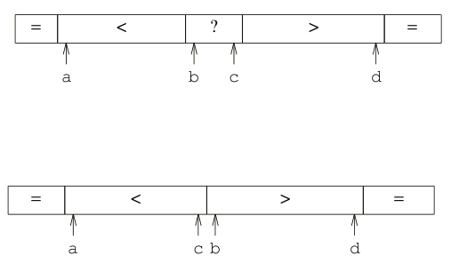

本页目录：

1、快速排序的二路划分
- 1-1、应用场景；
- 1-2、工作原理；
- 1-3、代码；

2、快速排序的三路划分
- 2-1、应用场景；
- 2-2、工作原理；
- 2-3、代码；
***

# 快速排序的二路划分
[参考文献](https://blog.csdn.net/yzllz001/article/details/50982841)
### 应用场景
`
数组中的元素都是独特的，重复的少
利：不浪费空间又可以快一点的排序
`

### 工作原理
1、取一个元素做基准数（参考）；
2、小于该基准数的元素放其左边，大于该基准数的元素放其右边；
（
    具体：先从右往左找一个小于基准数的数，然后交换位置，
          再从左往右找一个大于基准数的数，然后交换位置。
 ）

3、该基准数的左右数组重复以上操作，直到子数组的元素个数小于等于1；

### 代码
```
    public static void sort(int a[], int low, int hight) {
        int i, j, index;
        if (low > hight) {
            return;
        }
        i = low;
        j = hight;
        index = a[i]; // 用子表的第一个记录做基准
        while (i < j) { // 从表的两端交替向中间扫描
            while (i < j && a[j] >= index)
                j--;
            if (i < j)
                a[i++] = a[j];// 用比基准小的记录替换低位记录
            while (i < j && a[i] < index)
                i++;
            if (i < j) // 用比基准大的记录替换高位记录
                a[j--] = a[i];
        }
        a[i] = index;// 将基准数值替换回 a[i]
        sort(a, low, i - 1); // 对低子表进行递归排序
        sort(a, i + 1, hight); // 对高子表进行递归排序

    }

    public static void quickSort(int a[]) {
        sort(a, 0, a.length - 1);
    }

    public static void main(String[] args) {
        int a[] = { 49, 38, 65, 97, 76, 13, 27, 49 };
        quickSort(a);
        System.out.println(Arrays.toString(a));
    }
```

# 快速排序的三路划分
[参考文献](https://blog.csdn.net/puppylpg/article/details/70233728)
### 应用场景
`
数组中的元素含有大量重复元素
`

### 工作原理
1、取一个数做基准数，设置四个游标；
（具体：左端a、b，右端c、d。b、c从两端向中间遍历序列，并将遍历到的元素与pivot比较）
2、b边的元素等于基准数，放到最左边（a后面），b边的元素小于基准数，放到最ab游标之间；
c边的元素等于基准数，放到最右边（c后面），b边的元素大于基准数，放到最bc游标之间。
(
    具体：
        先从右往左找一个小于或者等于基准数的数：
              等于时，与a游标数值交换，a、b游标前进一位，
              小于时，与b游标数值交换，b游标前进一位；
          再从左往右找一个大于或者基准数的数：
               等于时，与d游标数值交换，c、d游标前进一位，
               大于时，与c游标数值交换，c游标前进一位；
     每次交换一次就换方向扫描。

)

3、将等于基准数的数据放到中间，小于的放到左边，大于的放右边，再对左右分别进行以上操作，直到子数组的元素个数小于等于1。

### 代码
```
import java.util.Arrays;

/**
 * Created by DK_Li on 2018/5/18.
 */
public class test {
    private static void quickSort(int[] a, int left, int right) {
        if (right <= left)
            return;

    /*
     * 工作指针
     * p指向序列左边等于pivot元素的位置
     * q指向序列右边等于Pivot元素的位置
     * i指向从左向右扫面时的元素
     * j指向从右向左扫描时的元素
     */
        int p, q, i, j;
        int pivot;// 锚点
        i = p = left;
        j = q = right - 1;
    /*
     * 每次总是取序列最右边的元素为锚点
     */
        pivot = a[right];
        while (true) {
        /*
         * 工作指针i从右向左不断扫描，找小于或者等于锚点元素的元素
         */
            while (i < right && a[i] <= pivot) {
            /*
             * 找到与锚点元素相等的元素将其交换到p所指示的位置
             */
                if (a[i] == pivot) {
                    swap(a, i, p);
                    p++;
                }
                i++;
            }
        /*
         * 工作指针j从左向右不断扫描，找大于或者等于锚点元素的元素
         */
            while (left <= j && a[j] >= pivot) {
            /*
             * 找到与锚点元素相等的元素将其交换到q所指示的位置
             */
                if (a[j] == pivot) {
                    swap(a, j, q);
                    q--;
                }
                j--;
            }
        /*
         * 如果两个工作指针i j相遇则一趟遍历结束
         */
            if (i >= j)
                break;

        /*
         * 将左边大于pivot的元素与右边小于pivot元素进行交换
         */
            swap(a, i, j);
            i++;
            j--;
        }
    /*
     * 因为工作指针i指向的是当前需要处理元素的下一个元素
     * 故而需要退回到当前元素的实际位置，然后将等于pivot元素交换到序列中间
     */
        i--;
        p--;
        while (p >= left) {
            swap(a, i, p);
            i--;
            p--;
        }
    /*
     * 因为工作指针j指向的是当前需要处理元素的上一个元素
     * 故而需要退回到当前元素的实际位置，然后将等于pivot元素交换到序列中间
     */
        j++;
        q++;
        while (q <= right) {
            swap(a, j, q);
            j++;
            q++;
        }

    /*
     * 递归遍历左右子序列
     */
        quickSort(a, left, i);
        quickSort(a, j, right);
    }

    private static void quick(int[] a) {
        if (a.length > 0) {
            quickSort(a, 0, a.length - 1);
        }
    }

    private static void swap(int[] arr, int a, int b) {
        int temp = arr[a];
        arr[a] = arr[b];
        arr[b] = temp;
    }

    public static void main(String[] args) {
        int a[] = {57,57,57,57, 68, 59,59,59,59,59,59,59,59,59, 52, 72, 28, 96,96,96,96,96,96,96,96,96,96,96,96, 33, 24};
        quick(a);
        System.out.println(Arrays.toString(a));
    }

}
```