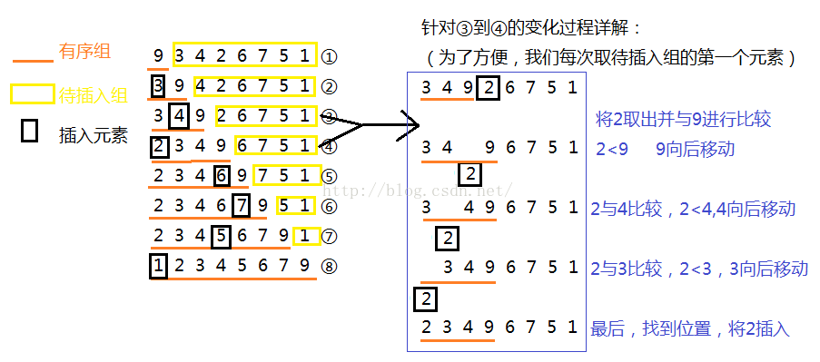

[参考文献](https://blog.csdn.net/llzk_/article/details/51628574)

本页目录：
- 1、应用场景；
- 2、工作原理；
- 3、代码；

***

# 应用场景
`
数组的元素大部分距离正确位置很近，数组的元素近乎有序
`
# 工作原理
1、将数组分为两组，有序组与待插入组。
2、取待插入组元素与有序组进行比较（一个一个比较），在<x<位置进行插入后面的数值向后移。
3、直到待插入组元素个数为0。

# 代码
```
import java.util.Arrays;

/**
 * Created by DK_Li on 2018/5/18.
 */
public class test {
    static void InsertionSort(int[] num, int n)
    {
        int i = 0;
        int j = 0;
        int tmp = 0;
        for(i = 1;i<n;i++)
        {
            tmp = num[i];//从待插入组取出第一个元素。
            j = i-1; //i-1即为有序组最后一个元素（与待插入元素相邻）的下标
            while(j>=0&&tmp<num[j])  //注意判断条件为两个，j>=0对其进行边界限制。第二个为插入判断条件
            {
                num[j+1] = num[j];//若不是合适位置，有序组元素向后移动
                j--;
            }
            num[j+1] = tmp;//找到合适位置，将元素插入。
        }
    }
    public static void main(String[] args) {
        int i = 0;
        int num[]={9,3,4,2,6,7,5,1};
        InsertionSort(num,8);
        System.out.println(Arrays.toString(num));
    }
}

```