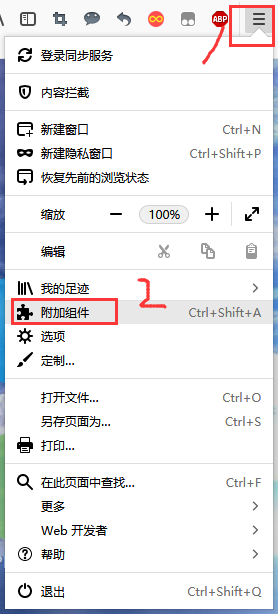
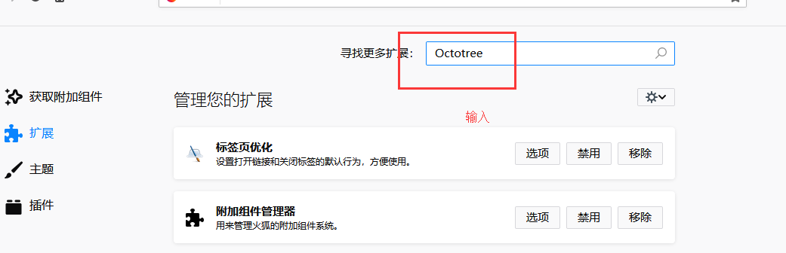
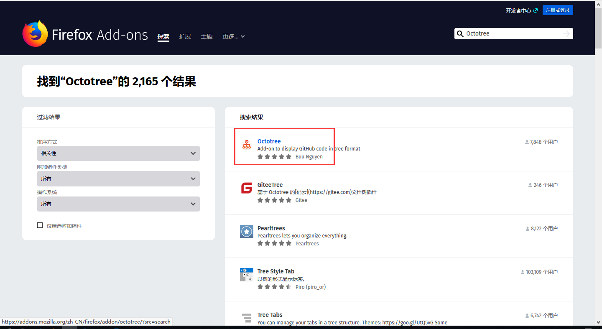

`假如发现教程或者下载出了问题，请qq联系我：2665252078`

本页目录：
- 1、[github使用Octotree的效果](#index-01)
- 2、[谷歌浏览器装Octotree的教程](#index-02)
    - 1-1、[Octotree的安装](#index-01-01)
- 3、[火狐浏览器装Octotree的教程](#index-03)
    - 1-1、[Octotree的安装](#index-03-01)

***

# <a name="index-01" href="#" >github使用Octotree的效果</a>

# <a name="index-02" href="#" >谷歌浏览器装Octotree的教程</a>
### <a name="index-01-01" href="#" >Octotree的安装</a>

>下载

>安装

# <a name="index-03" href="#" >火狐浏览器装Octotree的教程</a>

### <a name="index-03-01" href="#" >Octotree的安装</a>

> 下载安装

