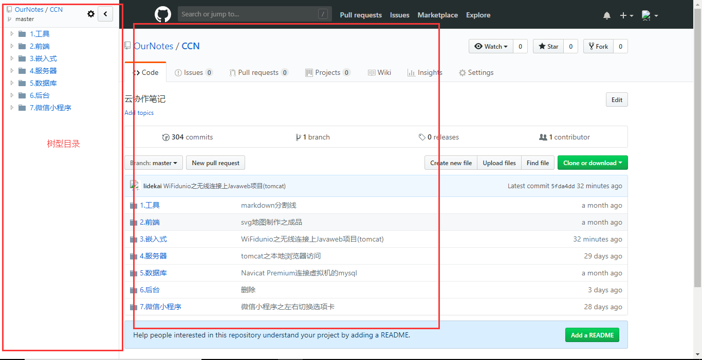

本页目录：
- [github使用Octotree的效果](#index-01)
- [Octotree的安装](#index-02)
    - [下载](#index-02-01)
    - [安装](#index-02-02)

***
# <a name="index-01" href="#" >github使用Octotree的效果</a>

# <a name="index-02" href="#" >Octotree的安装</a>

### <a name="index-02-01" href="#" >下载</a>

### <a name="index-02-02" href="#" >安装</a>

`
刷新github就可以看到效果
`

